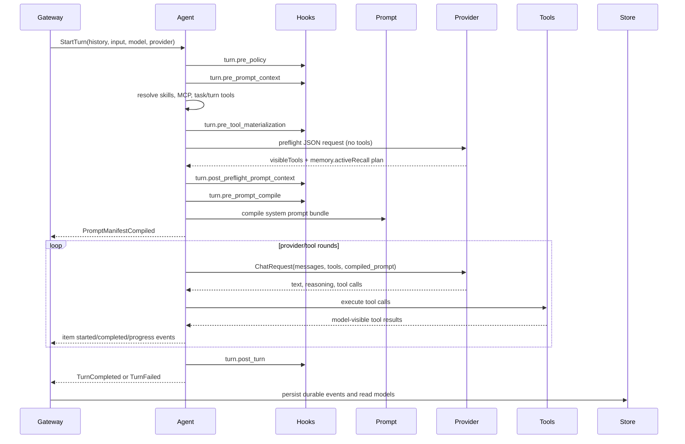

The agent loop lives in `crates/agent`. It is the execution engine for a thread turn after the gateway has accepted `turn/start`, persisted the initial state, and selected the provider/model.

The gateway does not call the provider directly for normal turns. It delegates to `AgentManager`, which owns a per-thread runtime task. That task receives commands such as `StartTurn`, runs one active turn at a time, and publishes durable events and live progress back to the gateway.

The agent loop is where Pioneer stops being a chat wrapper. It decides when to call the model, which tools the model may see, how tool results return to the model, when a failed tool deserves a retry, when a child task must be waited on, and when the final answer is allowed to close the turn.

Domain side work is attached through the hook runtime. The loop dispatches lifecycle phases such as `turn.pre_policy`, `turn.pre_prompt_context`, `turn.post_preflight_prompt_context`, `turn.pre_tool_materialization`, `turn.pre_prompt_compile`, and `turn.post_turn`; hooks contribute typed policy, context, prompt sections, tool bundles, and diagnostics. The loop should not contain domain-specific branches for memory extraction, recall policy, or similar future subsystems.

<Note>
  The agent loop does not persist directly to SQLite. It emits durable events. The gateway persists those events and publishes committed notifications. See [Gateway](/architecture/gateway) and [Persistence Layer](/architecture/persistence).
</Note>

## Why This Layer Exists

Provider APIs are not enough to run an assistant. Pioneer needs a layer that can repeatedly call a provider, execute real tools between provider calls, update UI state while work is happening, and preserve enough state to recover from interruptions.

That responsibility belongs in `pioneer-agent` rather than in the gateway handlers because it is turn execution logic, not transport logic. It also does not belong in provider adapters because provider adapters should only translate common chat requests into provider-specific API calls.

## Thread Runtime

`run_agent_loop` in `crates/agent/src/agent_loop.rs` is the per-thread command loop. It keeps the active turn handle, turn run id, cancellation token, and recovery context. A second running turn for the same thread is rejected, because the thread transcript and tool state are linear.

When a turn starts, the loop resolves the provider from `ProviderRegistry`, builds an `ActiveTurnRequest`, and spawns the chat execution task. Cancellation uses a short grace period before the runtime marks the turn interrupted.

## Chat Mode And Agent Mode

Pioneer has two thread modes:

| Mode | Behavior |
|---|---|
| `chat` | Sends history and the current user message to the provider. No tools are exposed. The system prompt may still be compiled and passed as provider prompt payload. |
| `agent` | Builds a full prompt bundle, resolves skills, materializes MCP/tools/tasks, runs provider rounds, executes tool calls, feeds tool results back into the model, and stops when the model produces a final answer or the loop budget is exhausted. |

The branch is in `execute_chat_turn_flow`. The gateway chooses the mode from the thread state and passes it into `AgentManager::start_turn`.

Chat mode exists for direct model conversations where tool access would be unnecessary or risky. Agent mode exists when Pioneer should be allowed to inspect files, run tools, call MCP servers, use skills, and coordinate subagents. This is a product-level distinction, not just a provider flag.

## Agent Mode Flow

## Model Input Construction

The model request is assembled in layers:

1. The gateway supplies historical `ChatMessage` values from completed turns.
2. The agent builds the current user message from `UserInput`.
3. The agent dispatches policy hooks, such as memory policy classification.
4. The agent dispatches pre-prompt-context hooks, such as deterministic memory recall.
5. The agent resolves active skills and builds a skills prompt.
6. The agent materializes task, turn, MCP, and skill tool bundles when tool calling is available.
7. The agent dispatches pre-tool-materialization hooks, such as memory tool-bundle contribution.
8. The agent runs turn preflight before the first main model round.
9. The agent dispatches post-preflight prompt-context hooks, such as active memory recall using the preflight plan.
10. The agent dispatches pre-prompt-compile hooks, such as memory prompt contract rendering.
11. The agent compiles the prompt bundle through `pioneer-promt`.
12. The tool router exposes only model-visible tool definitions for the current round.
13. Recovered tool context is appended as assistant tool-call and tool-result messages when a turn is being recovered.

The provider receives a `ChatRequest` containing `messages`, optional `tools`, `parallel_tool_calls`, and `compiled_prompt`. Provider adapters are responsible for mapping that common request into provider-specific API payloads.

The ordering is intentional. History comes from the gateway because it is persisted thread state. Skills, MCP tools, task tools, and hook contributions are resolved inside the agent because they are turn-scoped capabilities. Preflight runs after tool materialization so it can see a compact index of registered hidden-domain tools, but before prompt compilation so post-preflight memory context can still become part of the prompt. The prompt is compiled after those decisions because skills, task orchestration, memory, retries, and future domains can add dynamic prompt sections or context.

For the exact prompt sections and history compression rules, see [Prompt And Context](/architecture/prompt).

## Turn Preflight

Agent mode runs an internal preflight request before the first main provider round. This request is a normal provider JSON request with `tools: none`, `tool_choice: none`, no compiled prompt, disabled reasoning, and a bounded output budget. It is not a user-visible answer and cannot execute tools.

Preflight receives structured input only:

- turn facts such as thread mode, tool-calling support, and a bounded input preview;
- `tools.coreTools`, the small always-visible tool list;
- `tools.candidateTools`, compact descriptors for hidden built-in domain tools that are registered and have handlers for this turn;
- memory deterministic recall summary and, when needed, the active recall planning input owned by the memory subsystem.

The provider output is a strict JSON plan. `tools.visibleTools` is a list of exact hidden tool names to reveal before the first main model round. It is not a domain list. The runtime clamps the list to registered, available, policy-allowed tools before sending provider tool definitions.

If the configured preflight model fails, the agent retries once through the current thread model when that endpoint differs. If both attempts fail, preflight falls back with no optional hidden built-in tools revealed. Core tools and dynamic extension tools remain available according to their own materialization rules. Memory active recall uses the memory-owned local fallback for its module.

Inside the main turn, the model can still call `request_tools` to reveal a hidden built-in domain for the next provider round. That expansion is monotonic within the turn: newly added tools are appended to the visible set, and already visible tools are not removed mid-turn.

## Tool Loop Guard

Agent mode uses `ToolLoopGuard` from `pioneer-tools` to prevent runaway loops. It limits provider rounds and total tool calls per turn. When the budget is exhausted, the prompt is refreshed with a final-answer instruction and tools are disabled so the model can finish from available evidence.

Tool retry is separate from tool-loop budget. `ToolRetryController` classifies recoverable tool failures, decides whether another corrected tool call should be attempted, and can inject retry instructions into the dynamic prompt section.

## Durable Events

The agent emits durable events such as:

- `PromptManifestCompiled`
- `TurnSkillsResolved`
- `SkillAuditEvents`
- `TurnLlmContextAppended`
- `ItemStarted`
- `ItemCompleted`
- tool retry lifecycle events
- provider failure and recovery events
- `TurnCompleted`, `TurnFailed`, or `TurnInterrupted`

The gateway listener persists these events through `CrudStore` before publishing committed notifications to clients. This keeps UI state and database state aligned.

## Hook Dispatch

Hooks let domains attach to the turn lifecycle without expanding the agent loop itself. Memory is the primary example today:

| Phase | Memory hook |
| --- | --- |
| `turn.pre_policy` | Classifies memory policy for the current turn. |
| `turn.pre_prompt_context` | Runs deterministic recall. |
| `turn.post_preflight_prompt_context` | Runs active recall from the preflight plan or memory-owned fallback. |
| `turn.pre_tool_materialization` | Contributes `memory_search`, `memory_list`, `memory_get`, `memory_remember`, and `memory_forget` when policy allows. |
| `turn.pre_prompt_compile` | Renders the `Memory Recall` prompt section from typed prompt context. |
| `turn.post_turn` | Runs post-turn durable fact extraction through service-owned semantic writes. |

The loop sees lifecycle phases and typed contribution sets. Memory-specific rules stay in memory hooks and `MemoryService`. See [Hook Runtime](/architecture/hooks) and [Memory Architecture](/architecture/memory).

## Recovery Context

Some tool outputs are retained in `turn_llm_context` while the turn is active. If a provider failure or recovery attempt needs to reconstruct the LLM-visible state, the agent can reinsert those retained tool-result messages in sequence order. After the turn reaches a terminal state, the gateway deletes retained LLM context rows for that turn.

Recovery is intentionally tied to durable events. Provider failures are classified, recovery jobs are scheduled by the gateway, and successful or failed recovery attempts are reconciled back into the turn lifecycle.

## Where Tooling Enters

The agent loop does not know how to run every tool itself. It asks `pioneer-tools` to build a runtime from built-ins plus extension bundles. MCP, skills, and tasks all become tool bundles, which means the provider sees one coherent tool list even though the backing implementations are very different.

That is the reason tool output policies live below the agent loop. The agent needs a model-visible result, but the gateway timeline, storage layer, and recovery layer may need different projections of the same output. See [Tools System](/architecture/tools).

## Related Pages

- [Prompt And Context](/architecture/prompt) explains how `compiled_prompt` and `messages` are built.
- [Hook Runtime](/architecture/hooks) explains lifecycle phases, subscriptions, execution policy, and typed contributions.
- [Memory Architecture](/architecture/memory) explains the memory hooks and service-owned write pipeline.
- [Provider System](/architecture/providers) explains how `ChatRequest` reaches OpenAI, Anthropic, Gemini, Ollama, Bedrock, CLI providers, and compatible endpoints.
- [Tasks And Subagents](/architecture/tasks) explains the task tools and child-thread execution path.
- [Tools System](/architecture/tools) explains routing, output projection, and retry classification.
