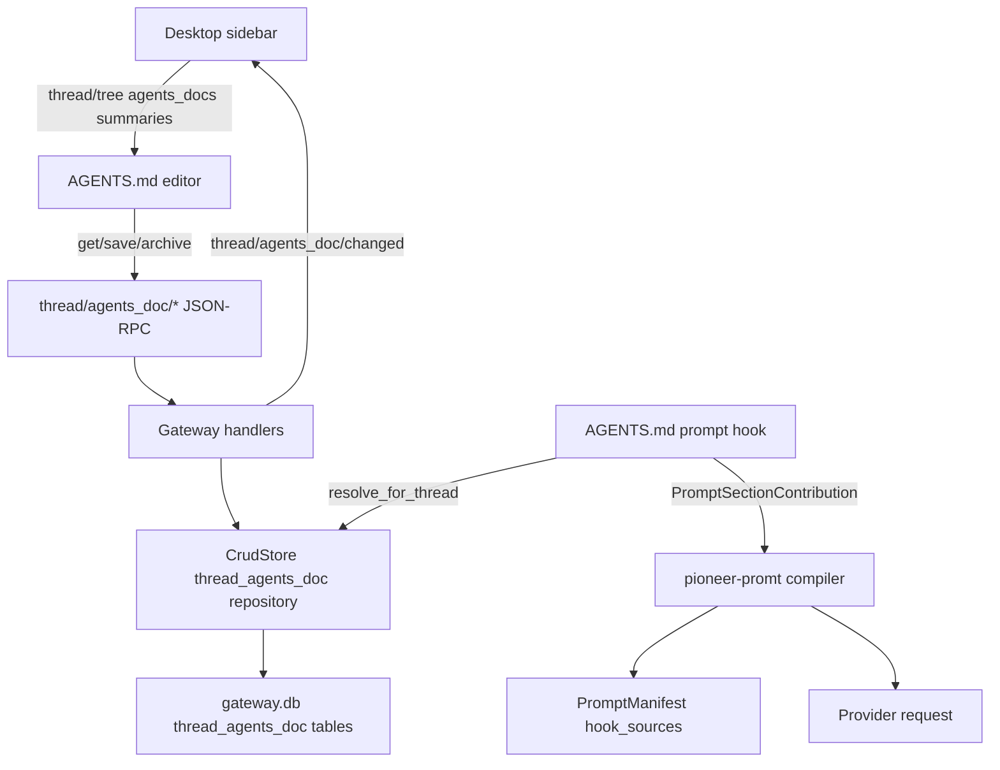

`AGENTS.md` is Pioneer's thread-tree instruction layer. It lets users place persistent prompt instructions at the workspace root or at a folder in the thread tree, then have new turns resolve the nearest active file automatically.

The implementation is gateway-owned. The desktop renders and edits the files, but the gateway stores them, resolves inheritance, emits notifications, and injects the effective file through the hook runtime.

## Design Goals

- One instruction file per tree scope: root or folder.
- Nearest active ancestor wins.
- Empty files are drafts and do not block inheritance.
- Clients see `AGENTS.md` as file rows in the thread tree without receiving full content in `thread/tree`.
- Prompt injection is a hook contribution, not a special branch in the agent loop.
- Versioned saves make autosave safe across multiple clients.

## System Flow



## Layer Responsibilities

| Layer | Responsibility |
|---|---|
| `crates/protocol` | Public DTOs, method constants, notification payloads, and JSON Schema export for `thread/agents_doc/*`. |
| `crates/migration` | Creates `thread_agents_doc` and `thread_agents_doc_revision` tables and uniqueness/index constraints. |
| `crates/entity` | Generated SeaORM entities for the tables. Do not hand-edit these. |
| `crates/crud` | Owns create, save, archive, summary listing, scope context, and nearest-ancestor resolution. |
| `crates/gateway` | Validates workspace/folder scope, exposes JSON-RPC handlers, sends change/tree notifications, and installs the prompt hook package. |
| `crates/promt` | Defines the AGENTS.md hook package and renders the prompt section contribution. |
| `crates/hooks` and `crates/agent` | Execute the hook at `turn.pre_prompt_compile`, aggregate prompt section metadata, and persist hook sources in `PromptManifest`. |
| `crates/desktop` | Renders sidebar file nodes, context menu actions, full-area editor, autosave, conflict handling, and local sidebar state updates. |

## Persistence Model

`thread_agents_doc` stores the current explicit file for a scope.

| Column | Meaning |
|---|---|
| `id` | Stable document id. |
| `workspace_id` | Workspace owner. |
| `folder_id` | `NULL` for the root file, otherwise the owning folder. |
| `status` | `draft`, `active`, or `archived`. |
| `title` | Always `AGENTS.md` for the current product surface. |
| `content` | Normalized Markdown content. |
| `content_sha256` | Digest of normalized content. |
| `version` | Monotonic version for optimistic concurrency. |
| `created_at`, `updated_at`, `archived_at` | Lifecycle timestamps. |
| `created_by`, `updated_by` | Optional actor metadata. |

`thread_agents_doc_revision` records saved versions, including archive events.

Uniqueness is enforced at the active/draft scope level:

- `uq_thread_agents_doc_root_active` permits one non-archived root file per workspace.
- `uq_thread_agents_doc_folder_active` permits one non-archived file per workspace/folder.
- Archived rows remain available for audit/revisions but are hidden from `thread/tree`.

## Status Semantics

`draft` means an explicit file exists but its normalized content is empty or whitespace-only. Drafts are shown to clients as summaries so users can reopen or delete them, but drafts are not effective prompt sources.

`active` means normalized content is non-empty. Only active files participate in inheritance and prompt injection.

`archived` means the explicit file was deleted from the user-facing tree. Archive increments the version and writes a revision with save reason `archive`.

## Resolution Algorithm

Resolution lives in `ThreadAgentsDocRepository::resolve_for_folder`.

For a folder scope:

1. Start at the requested folder.
2. Look for an active document in that folder.
3. If none exists, walk to the parent folder and repeat.
4. If no folder ancestor has an active document, check the root scope.
5. Return `None` when no active document exists anywhere in the ancestry.

For a thread, `resolve_for_thread` first reads `thread_placement` to find the folder. If no placement exists, the thread resolves against the root scope.

The resolved payload includes:

- the active document;
- `source_folder_id`, or `null` for root;
- `source_path`, a display path from root folder to source folder;
- `inherited`, true when the effective source is not the requested folder itself;
- `resolved_for_folder_id` and `resolved_at`.

## Desktop Model

The desktop stores AGENTS.md summaries in `PioneerDesktop::thread_agents_doc_summaries`, keyed by root or folder id.

The sidebar tree inserts a virtual `AGENTS.md` file node when either:

- the gateway returned a summary for that scope in `thread/tree`; or
- the editor is currently open for that scope.

Root-level creation is available from the sidebar empty/root area context menu. Folder-level creation is available from the folder context menu. Both call `open_agents_doc_editor`, which switches the main content area to `MainContentView::AgentsDoc`.

The editor is not a modal. It owns a GPUI component editor input configured as a Markdown code editor, with line numbers, soft wrap, and autosave.

## Autosave And Conflicts

The editor loads `ThreadAgentsDocGetResponse` and starts with the explicit document content. It does not edit inherited parent content in place.

On input changes, the editor debounces autosave and calls `thread/agents_doc/save` with:

- `workspace_id`;
- optional `folder_id`;
- normalized content;
- `expected_version` from the last loaded/saved explicit document;
- `save_reason: "autosave"`.

If the gateway returns a version conflict, the editor reloads the remote explicit document and enters a conflict state. The user can reload remote content or overwrite the remote document with the local buffer.

## Prompt Injection

AGENTS.md reaches the model through a hook package, not through a direct compiler branch.

`crates/gateway/src/prompt_hooks.rs` installs `agents_doc_prompt_hook_package` into the gateway hook runtime. The package comes from `crates/promt/src/hooks.rs`.

The hook subscribes to `HookPhase::TurnPrePromptCompile` with:

| Property | Value |
|---|---|
| Hook id | `pioneer.thread_agents_doc_prompt` |
| Package id | `pioneer.prompt.agents_doc` |
| Domain | `pioneer.thread_agents_doc` |
| Execution | blocking |
| Failure policy | fail closed |
| Visibility | internal |
| Contribution | `PromptSectionContribution` |
| Section id | `agents_md` |
| Section title | `AGENTS.md` |
| Hook budget | `16000` chars |

At execution time the hook requires `workspace_id` and `thread_id` in the hook context. It resolves the effective active document for the thread through `CrudStore::resolve_thread_agents_doc_for_thread`.

If no effective document exists, the hook contributes nothing. If a document exists, it emits a prompt section with a document source reference and content wrapped as:

```text
These instructions come from the effective AGENTS.md for this thread tree scope. System, developer, and explicit user messages take precedence.

<AGENTS_MD>
...
</AGENTS_MD>
```

The prompt compiler treats this like any other hook prompt section. The agent later persists hook source metadata in `PromptManifest.hook_sources`, including the hook id, subscription id, contribution id, section id, contribution kind, priority, source count, and truncation state.

## Protocol And Notifications

The public API is documented in [AGENTS.md API](/protocol/agents-md).

The important client behavior is:

- `thread/tree` returns `agents_docs` summaries without full content.
- `thread/agents_doc/get` returns explicit content and effective inherited context for one scope.
- `thread/agents_doc/save` creates or updates the explicit file for one scope.
- `thread/agents_doc/archive` removes the explicit file for one scope.
- `thread/agents_doc/resolve_for_thread` resolves the effective file for a concrete thread.
- `thread/agents_doc/changed` and `thread/tree/changed` tell clients to refresh local state.

## Developer Rules

- Keep all AGENTS.md database access behind `CrudStore` and `ThreadAgentsDocRepository`.
- Do not add direct desktop filesystem access; the gateway is the source of truth.
- Do not inject AGENTS.md by editing prompt compiler internals; use the hook package.
- Treat drafts as explicit UI state but never as effective prompt sources.
- Keep `thread/tree` summaries content-free.
- Always send `expected_version` from autosave-capable clients.
- Add protocol schemas and docs when changing public payloads.

## Related Pages

- [AGENTS.md User Guide](/desktop/agents-md) explains the user workflow.
- [AGENTS.md API](/protocol/agents-md) documents JSON-RPC methods and notifications.
- [Hook Runtime](/architecture/hooks) explains lifecycle phases and typed contributions.
- [Prompt And Context](/architecture/prompt) explains how hook prompt sections become model input.
