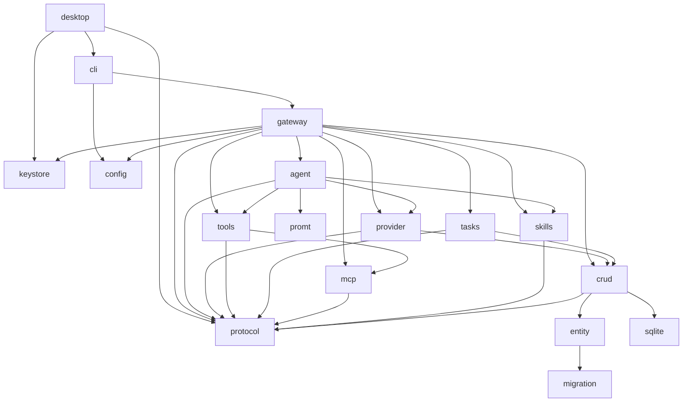

Pioneer is a Cargo workspace with seventeen Rust crates. The split is intentionally direct: public protocol, gateway orchestration, agent execution, provider adapters, tools, tasks, MCP, skills, prompt compilation, secret storage, and durable storage are separate layers.

This page is a map, not the architecture itself. Use it when you need to know where a responsibility lives before reading the deeper page for that layer.

## Why The Workspace Is Split This Way

The split follows runtime boundaries. Provider code should not know about WebSocket sessions. Prompt compilation should not know about SQLite. Tools should not know which client requested a turn. The gateway is allowed to wire everything together; most other crates should stay focused.

That shape keeps changes smaller. Adding a provider should mostly touch `provider` and gateway provider listing/key handling, with secret values routed through `keystore`. Changing prompt section ordering should mostly touch `promt` and prompt tests. Adding a task event should touch `protocol`, `tasks`, `crud`, and gateway notifications, but not desktop-specific execution code.

## Workspace Crates

| Crate | Kind | Responsibility |
|---|---:|---|
| `crates/gateway` | binary + library | Main service. Owns WebSocket JSON-RPC sessions, auth, settings, workspaces, threads, turns, providers, MCP service, skills handlers, task runtime, resilience workers, and persistence coordination. |
| `crates/desktop` | binary | Native GPUI desktop client. Connects to gateways, starts/manages a local gateway, and renders conversations, providers, skills, MCP, tasks, and settings. |
| `crates/cli` | binary | Command-line utility, service management entry point, token issuance, and keystore maintenance surface. |
| `crates/protocol` | library | Public JSON-RPC contract, request/response types, notification types, domain DTOs, method constants, and schema export. |
| `crates/agent` | library | Per-thread agent runtime, turn execution, provider loop, tool loop, MCP/tool/task materialization hooks, skill resolution, recovery handling. |
| `crates/keystore` | library | Secret storage facade backed by `db-keystore`, stable secret ids, metadata, permission hardening, and an in-memory test store. |
| `crates/promt` | library | Prompt compiler. Builds stable and dynamic system prompt sections, reads bootstrap files, applies prompt budgets, emits prompt manifests and fingerprints. |
| `crates/provider` | library | Provider trait, provider registry, provider implementations, streaming/non-streaming chat, tool-call parsing, attachment normalization and upload planning. |
| `crates/tools` | library | Built-in tool registry, shell sessions, filesystem tools, patch application, grep, web search/fetch/download, computer use, dynamic tool extension bundles, output policies, retry classification. |
| `crates/tasks` | library | Durable task service, scheduler, trigger calculator, executor registry, event bus, projectors, retries, deliveries, write locks, startup reconciliation. |
| `crates/mcp` | library | MCP install config parser, validation, secret redaction/materialization, stdio and streamable HTTP clients, runtime connector, catalog snapshots, retry policy. |
| `crates/skills` | library | Agent Skills-compatible contract parser, installer, validation, security scanning, dependency preflight, policy merge, catalog loading, runtime tool declarations, prompt building. |
| `crates/crud` | library | SeaORM-backed repository layer and projectors for turns, items, threads, tasks, skills, MCP, recovery jobs, attachments, prompt manifests, and LLM context retention. |
| `crates/entity` | library | SeaORM entity definitions generated/maintained for the SQLite schema. |
| `crates/migration` | library | SeaORM migrations for database schema evolution. |
| `crates/sqlite` | library | SQLite-specific helpers, especially write coordination for concurrent async access. |
| `crates/config` | library | Layered configuration loader for default config, user config, gateway config, install paths, tools, provider attachments, skills, database, and auth. |

## Dependency Direction

The important rule is that `protocol` sits at the public edge while `gateway` is the integration layer. Lower-level crates should not need to know about desktop UI state. Domain crates expose typed APIs that the gateway wires into request handlers and background runtimes.

## Where To Look First

| Question | Start here |
|---|---|
| How does a JSON-RPC method reach a handler? | `crates/gateway/src/message/dispatch.rs` |
| How does `turn/start` become an agent run? | `crates/gateway/src/message/turn_handlers.rs`, then `crates/agent/src/manager.rs` and `crates/agent/src/agent_loop.rs` |
| How is the LLM prompt compiled? | `crates/agent/src/chat/mod.rs`, then `crates/promt/src/compile/compiler.rs` |
| How is previous conversation context selected? | `crates/gateway/src/message/provider_handlers.rs` |
| How are tools exposed to the model? | `crates/agent/src/chat/mod.rs`, `crates/tools/src/lib.rs` |
| How are MCP servers installed and called? | `crates/gateway/src/message/mcp/mod.rs`, `crates/gateway/src/mcp_service.rs`, `crates/mcp/src/config.rs` |
| How are secret values stored? | `crates/keystore/src/lib.rs`, `crates/gateway/src/secrets.rs`, `crates/desktop/src/gateway/secrets.rs` |
| How are skills resolved into prompt and tools? | `crates/agent/src/chat/skills.rs`, `crates/skills/src/prompt.rs`, `crates/skills/src/runtime.rs` |
| How do tasks create subagents? | `crates/gateway/src/message/task_agent_executor.rs`, `crates/tasks/src/service.rs` |
| How is data persisted? | `crates/crud/src/lib.rs`, `crates/crud/src/projector.rs`, `crates/crud/src/task_projector.rs` |

## Related Pages

- [Architecture Overview](/architecture/overview) explains how these crates fit into the runtime.
- [Gateway](/architecture/gateway) explains the integration layer.
- [Protocol Layer](/architecture/protocol) explains the public crate shared by clients and gateway.
