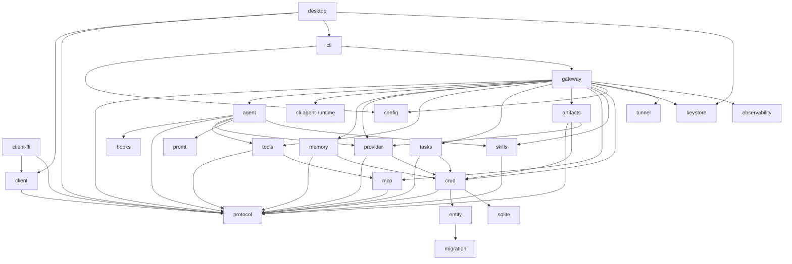

Pioneer is a Cargo workspace with twenty-five Rust crates. The split is intentionally direct: public protocol, gateway orchestration, shared client logic, client FFI, CLI-backed agent runtimes, agent execution, hook runtime, provider adapters, tools, artifacts, tasks, MCP, skills, prompt compilation, agent memory, remote access, secret storage, telemetry, and durable storage are separate layers.

This page is a map, not the architecture itself. Use it when you need to know where a responsibility lives before reading the deeper page for that layer.

## Why The Workspace Is Split This Way

The split follows runtime boundaries. Provider code should not know about WebSocket sessions. Prompt compilation should not know about SQLite. Tools should not know which client requested a turn. The gateway is allowed to wire everything together; most other crates should stay focused.

That shape keeps changes smaller. Adding an API provider should mostly touch `provider` and gateway provider listing/key handling, with secret values routed through `keystore`. Adding a CLI-backed agent runtime should touch `cli-agent-runtime`, gateway CLI runtime handlers, protocol contracts, and shared client presentation helpers, not `provider`. Changing prompt section ordering should mostly touch `promt` and prompt tests. Adding a task event should touch `protocol`, `tasks`, `crud`, and gateway notifications, but not shell-specific UI code.

## Workspace Crates

| Crate | Kind | Responsibility |
|---|---:|---|
| `crates/gateway` | binary + library | Main service. Owns WebSocket JSON-RPC sessions, auth, settings, workspaces, threads, turns, providers, MCP service, skills handlers, task runtime, resilience workers, and persistence coordination. |
| `crates/desktop` | binary | Native GPUI desktop client. Connects to gateways, starts/manages a local gateway, and renders conversations, providers, skills, MCP, tasks, and settings. |
| `crates/cli` | binary | Command-line utility, service management entry point, token issuance, and keystore maintenance surface. |
| `crates/protocol` | library | Public JSON-RPC contract, request/response types, notification types, domain DTOs, turn permission/security/approval/audit types, voice contracts, method constants, and schema export. |
| `crates/client` | library | Shared shell-neutral client core: gateway transport, request helpers, notification reducers, read models, selectors, timeline rows, composer and voice workflows, permission/security display, provider/model helpers, skills/MCP/settings/artifact presentation, and schema contracts. |
| `crates/client-ffi` | library | C ABI/JSON boundary around `pioneer-client` for native shells such as the React Native Nitro module. Owns FFI runtime glue, tagged JSON responses, diagnostics, and client schema export. |
| `crates/cli-agent-runtime` | library | Local CLI-backed agent runtime boundary. The committed implementation drives Codex CLI app-server sessions, events, approvals, requests, model probes, login, review, compaction, fork, and steering. |
| `crates/agent` | library | Per-thread agent runtime, turn execution, provider loop, tool loop, lifecycle hook wiring, MCP/tool/task materialization, skill resolution, recovery handling. |
| `crates/hooks` | library | Typed lifecycle hook runtime, hook subscriptions, phase requests, contribution sets, execution/failure policy, dependencies, diagnostics, and hook-run summaries. |
| `crates/artifacts` | library | Workspace-scoped artifact service, blob store abstraction, ingestion, path validation, quotas, GC planning, projections, and provider artifact resolution. |
| `crates/memory` | library | Durable agent memory service, memvid backend integration, recall ranking, semantic writes, canonical keys, candidate policy, tombstones, and repair diagnostics. |
| `crates/keystore` | library | Secret storage facade backed by `db-keystore`, stable secret ids, metadata, permission hardening, and an in-memory test store. |
| `crates/tunnel` | library | Remote access supervisor for gateway relay connectivity. Builds and supervises the rathole client, validates remote-access settings, publishes status snapshots, and handles reconnect policy. |
| `crates/observability` | library | Telemetry and diagnostics initialization shared by gateway/runtime binaries. |
| `crates/promt` | library | Prompt compiler. Builds stable and dynamic system prompt sections, reads bootstrap files, renders current permission guidance, applies prompt budgets, emits prompt manifests and fingerprints. |
| `crates/provider` | library | Remote model API provider trait, registry, provider implementations, streaming/non-streaming chat, tool-call parsing, attachment normalization, model listing, and upload planning. CLI-backed runtimes intentionally live outside this crate. |
| `crates/tools` | library | Built-in tool registry, permission evaluation and approval brokering, security snapshot enforcement, native sandbox backend preparation, shell sessions, filesystem tools, patch application, grep, web search/fetch/download, computer use, dynamic tool extension bundles, output policies, retry classification. |
| `crates/tasks` | library | Durable task service, scheduler, trigger calculator, executor registry, event bus, projectors, retries, deliveries, write locks, startup reconciliation. |
| `crates/mcp` | library | MCP install config parser, validation, secret redaction/materialization, stdio and streamable HTTP clients, runtime connector, catalog snapshots, retry policy. |
| `crates/skills` | library | Agent Skills-compatible contract parser, installer, validation, security scanning, dependency preflight, policy merge, catalog loading, runtime tool declarations, prompt building. |
| `crates/crud` | library | SeaORM-backed repository layer and projectors for turns, items, threads, artifacts, tasks, skills, MCP, recovery jobs, prompt manifests, and LLM context retention. |
| `crates/entity` | library | SeaORM entity definitions generated/maintained for the SQLite schema. |
| `crates/migration` | library | SeaORM migrations for database schema evolution. |
| `crates/sqlite` | library | SQLite-specific helpers, especially write coordination for concurrent async access. |
| `crates/config` | library | Layered configuration loader for default config, user config, gateway config, install paths, tools, artifacts, provider attachments, skills, database, and auth. |

## Dependency Direction

The important rule is that `protocol` sits at the public edge while `gateway` is the integration layer. Lower-level crates should not need to know about desktop UI state. Domain crates expose typed APIs that the gateway wires into request handlers and background runtimes.

## Where To Look First

| Question | Start here |
|---|---|
| How does a JSON-RPC method reach a handler? | `crates/gateway/src/message/dispatch.rs` |
| How does `turn/start` become an agent run? | `crates/gateway/src/message/turn_handlers.rs`, then `crates/agent/src/manager.rs` and `crates/agent/src/agent_loop.rs` |
| How does a mobile or desktop client project gateway events? | `crates/client/src/transport`, `crates/client/src/state`, `crates/client/src/conversation`, `crates/client/src/timeline`, then `crates/client-ffi/src/lib.rs` for shell FFI. |
| How does the React Native app call shared Rust client logic? | `crates/client-ffi/src/lib.rs`, `pioneer-app/modules/pioneer-client-nitro/src/PioneerClient.nitro.ts`, and `pioneer-app/src/client/native.ts`. |
| How are CLI-backed agent runtimes configured and driven? | `crates/cli-agent-runtime/src/lib.rs`, `crates/gateway/src/cli_runtime/*`, `crates/protocol/src/cli_runtime.rs`, and `crates/client/src/cli_runtime`. |
| How is the LLM prompt compiled? | `crates/agent/src/chat/mod.rs`, then `crates/promt/src/compile/compiler.rs` |
| How are turn lifecycle hooks registered and run? | `crates/hooks/src/runtime.rs`, `crates/hooks/src/registry.rs`, then `crates/agent/src/hooks.rs` |
| How does agent memory recall and write durable facts? | `crates/memory/src/hooks`, `crates/gateway/src/memory_runtime.rs`, then `crates/memory/src/service.rs` |
| How is previous conversation context selected? | `crates/gateway/src/message/provider_handlers.rs` |
| How are tools exposed to the model? | `crates/agent/src/chat/mod.rs`, `crates/tools/src/lib.rs` |
| How are tool permissions evaluated and approved? | `crates/protocol/src/turn_permissions.rs`, `crates/tools/src/orchestrator.rs`, `crates/gateway/src/message/permission_handlers.rs`, and `crates/client/src/composer/permissions.rs`. |
| How are MCP servers installed and called? | `crates/gateway/src/message/mcp/mod.rs`, `crates/gateway/src/mcp_service.rs`, `crates/mcp/src/config.rs` |
| How are secret values stored? | `crates/keystore/src/lib.rs`, `crates/gateway/src/secrets.rs`, `crates/desktop/src/gateway/secrets.rs` |
| How are skills resolved into prompt and tools? | `crates/agent/src/chat/skills.rs`, `crates/skills/src/prompt.rs`, `crates/skills/src/runtime.rs` |
| How do tasks create subagents? | `crates/gateway/src/message/task_agent_executor.rs`, `crates/tasks/src/service.rs` |
| How is remote gateway access supervised? | `crates/tunnel/src/lib.rs`, `crates/gateway/src/settings.rs`, and `crates/gateway/src/lib.rs` remote-access startup/shutdown wiring. |
| How is data persisted? | `crates/crud/src/lib.rs`, `crates/crud/src/projector.rs`, `crates/crud/src/task_projector.rs` |

## Related Pages

- [Architecture Overview](/architecture/overview) explains how these crates fit into the runtime.
- [Gateway](/architecture/gateway) explains the integration layer.
- [Client Architecture](/architecture/clients) explains `client`, `client-ffi`, desktop, and mobile shell boundaries.
- [CLI Runtime Architecture](/architecture/cli-runtime) explains `cli-agent-runtime` and gateway `cli_runtime` integration.
- [Protocol Layer](/architecture/protocol) explains the public crate shared by clients and gateway.
- [Remote Access Architecture](/architecture/remote-access) explains `tunnel` and gateway remote-access supervision.
