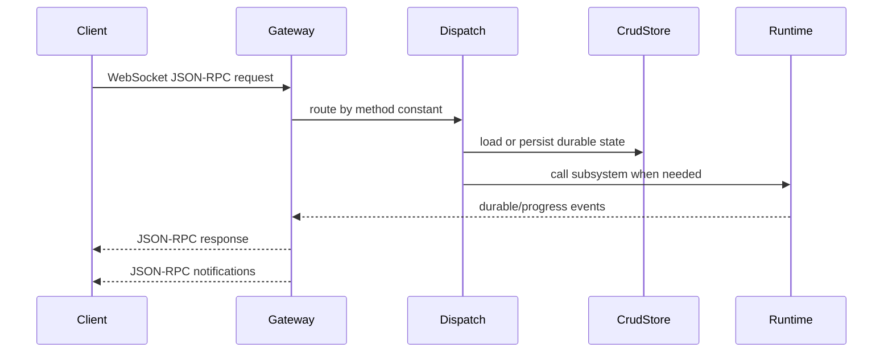

The gateway is the central runtime of Pioneer. It is a long-running Tokio service started by `pioneer_gateway::run_gateway_until_shutdown()`. Desktop, mobile, and custom clients can connect to it over WebSocket JSON-RPC, but the gateway is the only process that owns durable Pioneer state.

The easiest way to reason about the gateway is to treat it as an operating environment for assistant work. It stores the state, owns the execution, supervises background jobs, and decides which events clients are allowed to see. The desktop app can ask for things to happen, but the gateway is where they happen.

<Tip>
  If you are trying to follow the main user-message path, read this page together with [Agent Loop](/architecture/agent-loop), [Prompt And Context](/architecture/prompt), and [Persistence Layer](/architecture/persistence).
</Tip>

## Why This Layer Exists

Pioneer cannot put important execution inside the desktop app because many operations outlive a single UI view: task schedules, recovery attempts, MCP server processes, long-running shell sessions, and provider streams. The gateway gives those operations a stable owner.

It also keeps multi-client behavior sane. If two clients connect to the same gateway and workspace, they should see the same thread history, provider settings, tasks, and MCP server state. That is only possible if clients are observers and command senders, not independent runtimes.

## Responsibilities

The gateway owns:

- WebSocket JSON-RPC transport and request dispatch
- session tracking and workspace-scoped notifications
- runtime home preparation, including `SOUL.md` and `IDENTITY.md` identity files
- gateway settings and keystore-backed secret storage
- workspace and thread lifecycle
- turn lifecycle and agent runtime wiring
- provider model listing and provider cache invalidation
- CLI agent runtime listing, probing, thread binding, approvals, login, review, compaction, fork, and steering
- MCP installation, runtime processes, catalogs, status, and tool materialization
- skill installation, upload sessions, catalog health, policy, and notifications
- task runtime, scheduler, task event bridge, deliveries, write locks, and subagent executor
- remote-access tunnel supervision and status notifications
- SQLite persistence through `pioneer-crud`
- resilience workers for timeouts, recovery jobs, stuck task repair, and cleanup

## Main Types

`MessageProcessor` in `crates/gateway/src/message/mod.rs` is the high-level request processor. It holds the runtime graph: `ThreadManager`, `AgentManager`, `ProviderRegistry`, `SessionManager`, `WorkspaceManager`, `CrudStore`, `GatewaySecrets`, context budgets, `McpService`, CLI runtime manager, remote access supervisor, task runtime, task agent executor, timeout supervisor, and recovery coordinator.

`SessionManager` in `crates/gateway/src/session/mod.rs` tracks connected WebSocket sessions, per-connection outbound channels, and the workspace associated with each connection. Most UI updates are sent as JSON-RPC notifications to thread subscribers or workspace subscribers.

`ThreadManager` in `crates/gateway/src/thread/mod.rs` keeps the in-memory thread state used during active interaction. Persistent state is still written through `CrudStore`.

`McpService` in `crates/gateway/src/mcp_service.rs` owns the live MCP runtime tasks. It starts, stops, restarts, and calls MCP servers, persists catalog snapshots, publishes runtime status, and materializes MCP tools for the agent loop.

`CLIAgentRuntimeManager` in `crates/gateway/src/cli_runtime/manager.rs` caches gateway-owned sessions for local CLI-backed agent runtimes. The committed runtime bridge uses Codex CLI app-server sessions from `pioneer-cli-agent-runtime`.

`RemoteAccessSupervisor` from `pioneer-tunnel` supervises the relay client used for remote access. Gateway settings control whether it should run; live state is published through settings snapshots and `gateway/remote_access/status_changed`.

`TaskRuntime` from `pioneer-tasks` is created by the gateway and then bridged back into the gateway through `TaskAgentExecutor` and `GatewayTaskToolProvider`.

`GatewaySecrets` in `crates/gateway/src/secrets.rs` is the gateway-facing facade over `pioneer-keystore`. It reads and writes workspace-scoped provider API keys, MCP secret values, and the singleton superuser JWT signing material without exposing raw values through normal settings or database records.

These types are deliberately not hidden behind a single abstract "app service." Pioneer has several runtimes with different lifecycles: WebSocket sessions are connection-scoped, agent loops are thread-scoped, MCP tasks are installation-scoped, task runs are scheduler-scoped, and settings are gateway-scoped. `MessageProcessor` wires them together without pretending they are the same kind of state.

## Runtime Home

At startup, the gateway resolves runtime home from `home_directory` and creates the directory if needed. The default is `~/.pioneer`.

The gateway also ensures two editable identity files exist at the root of runtime home:

- `SOUL.md`
- `IDENTITY.md`

Missing files are created with the current seed content. Existing files are never overwritten during startup. Prompt compilation later reads these files from runtime home, so changes made by the user or by the model can affect future turns without a code change.

## Request Dispatch

Incoming WebSocket messages are JSON-RPC requests or notifications. Dispatch is method-name based. Method constants live in `pioneer-protocol`, while the gateway handler code is split by feature:

| Area | Gateway files |
|---|---|
| Workspaces | `message/workspace_handlers.rs` |
| Threads | `message/thread_handlers.rs` |
| Turns | `message/turn_handlers.rs`, `message/agent_runtime.rs` |
| Providers | `message/provider_handlers.rs` |
| CLI runtimes | `cli_runtime/*` |
| Skills | `message/skills/*` |
| MCP | `message/mcp/*`, `mcp_service.rs` |
| Tasks | `message/task_handlers.rs`, `message/tasks.rs`, `message/task_tools/*`, `message/task_agent_executor.rs` |

## Turn Start Lifecycle

`turn/start` is the most important gateway flow:

<Steps>
  <Step title="Validate request">
    `turn_handlers.rs` checks required identifiers, selected execution backend, and delegates thread mutation to `ThreadManager::turn_start`.
  </Step>
  <Step title="Persist initial state">
    The gateway calls `CrudStore::materialize_turn_start`, which writes the thread, sandbox policy, turn, turn input, and status history.
  </Step>
  <Step title="Prepare agent runtime">
    `AgentManager::ensure_thread` creates or reuses a per-thread agent runtime. The gateway starts a listener task for durable agent events and live progress events.
  </Step>
  <Step title="Load context">
    The gateway loads conversation history with `load_conversation_history`. It also loads workspace skill policy records so the agent can resolve skills with gateway/workspace overrides.
  </Step>
  <Step title="Dispatch execution">
    `AgentManager::start_turn` receives thread mode, provider/model or CLI runtime backend, input, history, and skill policy. From this point the agent runtime owns the turn execution.
  </Step>
  <Step title="Notify clients">
    The gateway sends the `turn/start` response, broadcasts `turn/started`, emits the user message item lifecycle, and may start background title generation for a new user-origin thread.
  </Step>
</Steps>

The important detail is that persistence happens before agent execution. The gateway first records that the turn exists, then dispatches it. That makes a partially failed turn visible and recoverable instead of disappearing because execution failed before the UI heard about it.

After the agent starts, the gateway mostly becomes an event bridge and durability layer for that turn. Durable agent events arrive from `AgentManager`, the gateway persists them through `CrudStore`, and only then are committed notifications published to clients.

## Notification Model

The gateway sends JSON-RPC responses for direct requests and JSON-RPC notifications for state changes. A successful `turn/start` response only means the gateway accepted the turn. The actual assistant work is observed through notifications: item started, item deltas, item completed, retries, recovery, task events, and terminal turn state.

This split matters for client authors. A client should not wait for a long `turn/start` response containing the final assistant message. It should subscribe to the thread timeline and render notifications as they arrive.

## Background Workers

When resilience workers start, the gateway binds the task bridge, repairs deterministic read-model violations, starts task scheduling, subscribes to task events, starts CLI runtime and remote-access supervision where configured, and runs a periodic loop. The loop clears stale skill uploads, polls timeout supervision, runs ready recovery jobs, and processes due task deliveries.

This means not all gateway work is request-driven. Some state changes are produced by schedulers, recovery workers, MCP runtime tasks, or task delivery processing, then published back through the same notification layer.

## Local And Remote Deployment

The gateway can run on the same machine as the desktop app or on a remote server. This does not change the architecture: tools, MCP servers, skill dependency checks, provider calls, CLI runtime binaries, keystore access, storage, and task execution happen on the gateway host. If a desktop or mobile app connects to a remote gateway, installing a command or file only on the client machine does not make it available to tools running on the remote gateway.

## Related Pages

- [Protocol Layer](/architecture/protocol) describes the request and notification contract exposed by the gateway.
- [Agent Loop](/architecture/agent-loop) explains what happens after the gateway dispatches a turn.
- [CLI Runtime Architecture](/architecture/cli-runtime), [MCP Architecture](/architecture/mcp), [Skills Architecture](/architecture/skills), and [Tasks And Subagents](/architecture/tasks) describe the subsystems the gateway owns.
- [Persistence Layer](/architecture/persistence) explains how gateway events become durable read models.
- [Secret Storage](/architecture/secrets) explains `keystore.db`, secret refs, and maintenance commands.
- [Remote Access Architecture](/architecture/remote-access) explains the gateway-owned tunnel supervisor.
