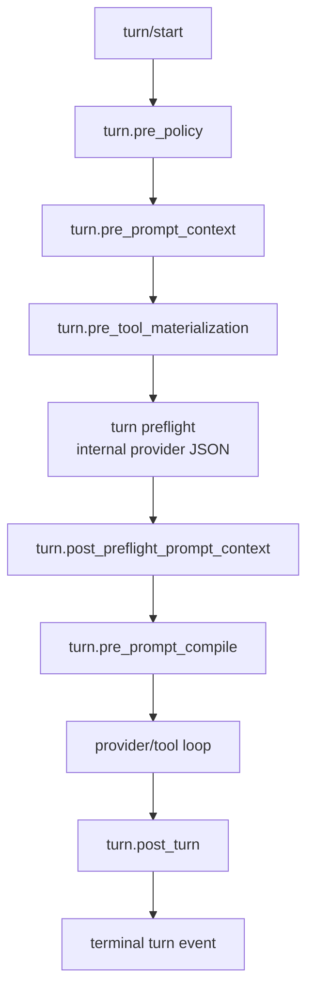

The hook runtime is Pioneer lever for running domain work around a turn without putting every domain rule inside the agent loop. It lives in `crates/hooks` and is wired by `crates/agent` and `crates/gateway`.

The design goal is simple: the agent loop should know lifecycle phases and typed contributions. It should not need memory-specific, skills-specific, or future domain-specific branches for every side behavior.

## Why Hooks Exist

Some work must happen around a turn but should not be part of the main model/tool loop:

- classify turn policy before prompt assembly;
- add compact context before prompt compilation;
- contribute model-visible tool bundles;
- add prompt sections;
- run post-turn extraction or cleanup;
- persist hook-run diagnostics for recovery and audit.

Before hooks, this kind of logic tends to accumulate as direct branches in the agent loop. That makes the loop harder to reason about and makes future domains copy the same pattern. Hooks make those side behaviors explicit, typed, ordered, and observable.

## Core Types

| Type | Role |
| --- | --- |
| `HookPhase` | Stable lifecycle phase such as `turn.pre_policy`, `turn.pre_prompt_context`, `turn.post_preflight_prompt_context`, `turn.pre_tool_materialization`, `turn.pre_prompt_compile`, and `turn.post_turn`. |
| `HookHandler` | A domain implementation subscribed to one or more phases. |
| `HookSubscription` | Registration that binds a handler to a phase with priority, dependencies, execution policy, failure policy, and visibility. |
| `HookHandlerRequest` | Typed input plus effective policy and prompt context sets for the phase. |
| `HookContribution` | Typed output such as policy, prompt context, prompt section, tool bundle, audit, or background job metadata. |
| `HookRuntime` | Executes subscriptions, applies ordering/dependencies/timeouts, validates capabilities, and aggregates responses. |

Handlers declare capabilities. A hook that contributes tool bundles must declare the tool-bundle capability. A hook that only reads context and writes internal domain state should not be able to emit prompt or tool contributions by accident.

## Turn Phases

The phase names are stable because they are also useful in diagnostics, hook-run persistence, and future operator tooling.

## Contributions

Hooks communicate through typed contributions instead of raw JSON blobs.

| Contribution | Used for |
| --- | --- |
| Policy | Turn-scoped domain policy, such as memory read/write rules. |
| Prompt context | Structured context that later prompt hooks can consume. |
| Prompt section | Rendered prompt text with ordering and budget metadata. |
| Tool bundle | Model-visible tool declarations plus runtime routing metadata. |
| Audit/diagnostic | Safe metadata for debugging and persistence. |
| Background job | Non-blocking work recorded through hook-run persistence. |

The agent loop aggregates these sets at phase boundaries. Domain hooks interpret their own policy and context; the loop stays generic.

## Execution Policy

Each subscription has execution behavior:

| Policy | Meaning |
| --- | --- |
| `Blocking` | Wait for the hook before continuing. |
| `Deadline` | Wait up to a bounded timeout and continue/fail according to failure policy. |
| `FireAndRecord` | Start work without delaying the user-visible path, but record lifecycle. |
| `Background` | Queue/record background work where supported. |

Failure policy is separate. Best-effort hooks can fail without failing the turn; required hooks can fail closed. The runtime records safe diagnostics and avoids putting raw sensitive payloads in summaries.

## Dependencies And Ordering

Subscriptions are sorted by priority and id, but explicit dependencies are the important mechanism. A hook can say it must run after another subscription on the same phase. The runtime detects missing dependencies, disabled dependencies, and cycles.

Memory uses phase ordering for recall: deterministic memory runs at `turn.pre_prompt_context`, then active memory runs at `turn.post_preflight_prompt_context` after the internal preflight plan has been built. The active hook receives typed prompt context plus the preflight-owned active recall plan or fallback.

## Persistence And Recovery

Gateway hook-run persistence records lifecycle state for subscribed work:

- started;
- completed;
- skipped;
- failed;
- timed out;
- backgrounded;
- latency and attempt metadata;
- safe diagnostics and contribution hashes.

Domain hooks should not invent their own retry tables for ordinary hook execution. Generic hook-run persistence owns that operational layer.

## Memory As A Hooked Domain

Agent memory is the first heavy domain built on this runtime:

- `MemoryPolicyClassifierHook` runs at `turn.pre_policy`.
- `MemoryDeterministicRecallHook` runs at `turn.pre_prompt_context`.
- `ActiveMemoryRecallHook` runs at `turn.post_preflight_prompt_context`.
- `MemoryToolBundleHook` runs at `turn.pre_tool_materialization`.
- `MemoryPromptContractHook` runs at `turn.pre_prompt_compile`.
- `MemoryPostTurnExtractorHook` runs at `turn.post_turn`.

The result is that memory can recall context, expose tools, render prompt policy, and extract durable facts without adding memory-specific extraction branches to the agent loop.

## Adding A Hook

When adding a hook:

1. Define typed input/output using existing hook request and contribution types where possible.
2. Give the handler a stable id and kind.
3. Declare only the capabilities it needs.
4. Register it with a phase, priority, execution policy, failure policy, and visibility.
5. Add tests for descriptor stability, capabilities, ordering/dependencies, policy behavior, and diagnostics.
6. Keep domain decisions inside the hook or its domain service, not in the agent loop.

## Related Pages

- [Agent Loop](/architecture/agent-loop) shows where turn phases are dispatched.
- [Memory Architecture](/architecture/memory) shows a full domain built on hooks.
- [Prompt And Context](/architecture/prompt) explains how prompt sections and context reach the provider.
