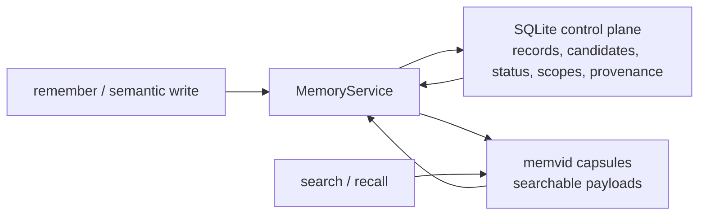
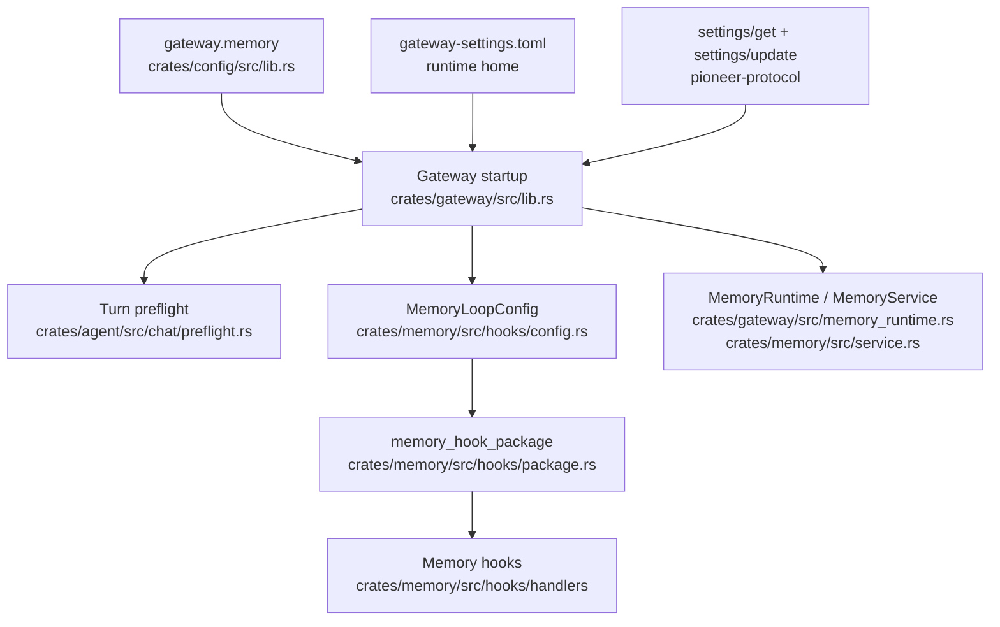
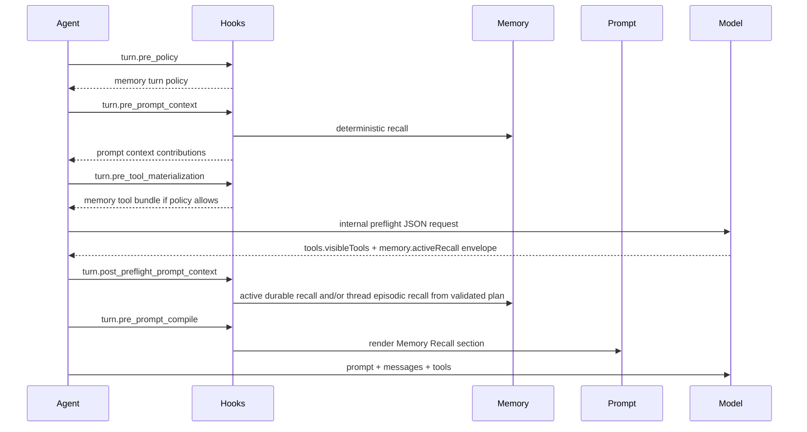

Pioneer memory is a durable domain service, not just a prompt trick. It combines a SQLite control plane, a memvid-backed searchable payload store, model-facing tools, lifecycle hooks, prompt policy, candidate scoring, and service-owned dedupe.

The user-facing behavior is: Pioneer can remember stable facts, recall them when useful, forget them when asked, and avoid creating duplicates. The architectural behavior is: the agent loop dispatches lifecycle phases, memory hooks contribute typed context/tools/prompt sections, and the memory service remains authoritative for storage and visibility.

There is also a separate episodic context layer for thread history. Durable memory answers "what should Pioneer remember about the user or project long term?" Thread episodic context answers "what old conversation fragment is useful for this turn?" Both can feed the prompt, but they have different storage rules, ranking rules, and product meaning.

## Main Components

| Component | Location | Responsibility |
| --- | --- | --- |
| Protocol types | `crates/protocol/src/memory.rs` | Public DTOs, semantic write contracts, candidates, notifications, schemas. |
| Memory service | `crates/memory` | Recall, ranking, semantic write pipeline, candidate policy, tombstones, memvid integration. |
| Control plane | `crates/crud` and `gateway.db` | Memory records, candidates, policy decisions, scopes, provenance, repair jobs. |
| Capsule backend | `memvid-core` through `MemvidMemoryBackend` | Searchable payload storage split by scope capsules. |
| Gateway runtime | `crates/gateway/src/memory_runtime.rs` and `crates/gateway/src/lib.rs` | Enables/disables memory, resolves runtime config, wires service, hook package config, and operation context. |
| Memory hooks | `crates/memory/src/hooks` | Memory policy, deterministic recall, active recall, tool materialization, prompt contract, and post-turn extraction. |
| Thread episodic context | `crates/gateway/src/thread_episodic.rs` and related hooks | Indexes visible thread history into bounded memvid capsules and contributes recalled snippets when the current turn needs conversation history. |
| Agent hook bridge | `crates/agent/src/hooks.rs` and `crates/agent/src/chat/mod.rs` | Dispatches lifecycle phases and consumes typed contributions without owning memory-domain rules. |
| Prompt contracts | `crates/promt` | Memory recall prompt and post-turn extractor prompt. |

## Storage Model

Memory has two stores with different authority:



Memvid is optimized for retrieval. SQLite is authoritative for policy and visibility. If memvid returns a stale hit, the service checks the control plane before exposing it. Deleted, superseded, expired, repair-needed, sensitive, or out-of-scope records are suppressed.

## Scopes

Memory scopes prevent leakage across unrelated work:

| Scope kind | Use |
| --- | --- |
| `user` | User identity, biography, global preferences. |
| `workspace` | Project-local policies, decisions, procedures, facts. |
| `agent` | Agent-specific facts when allowed by config. |
| `thread` | Narrow turn/thread references for future context systems. |
| `task` | Task-local operational context and future extensions. |

Gateway defaults are configured under `gateway.memory`:

```toml
[gateway.memory]
enabled = true
capsules_dir = "memory/capsules"
allow_global_user_by_default = true
allow_global_agent_by_default = false
deterministic_recall_enabled = true
active_recall_enabled = true
tools_enabled = true
proactive_writes_enabled = true
background_extraction_enabled = true
debug_trace_enabled = false
strict_diagnostics_enabled = false
```

The capsule directory is resolved under runtime home. Absolute paths, empty paths, `..`, and unsafe runtime escapes are rejected.

## Durable Memory Vs Thread Context

Durable memory and thread context are intentionally split.

| Layer | Stores | Used for | Should not be used for |
| --- | --- | --- | --- |
| Durable memory | Stable facts, preferences, recurring instructions, project decisions, canonical keys, provenance, candidates, tombstones. | Personalization, continuity across threads, long-lived project behavior, remembering and forgetting. | Raw transcript replay, every temporary debugging step, every tool result, every attachment. |
| Thread episodic context | Indexed snippets from visible conversation items, scoped by workspace/thread and ranked for the current turn. | Follow-ups about earlier discussion, "what did we decide?", old research snippets, context from another part of a long thread. | Permanent user facts, policy decisions, secrets, automatic prompt stuffing. |

Thread context uses memvid too, but it is not the same capsule namespace as durable memory. It is a separate indexed conversation surface with its own `gateway.thread_episodic` configuration. The service can search current-thread context and workspace-thread context through bounded read-only recall, then inject only selected snippets into prompt context.

When a recalled thread snippet came from a message with artifacts, Pioneer can attach artifact references to that snippet. The prompt still receives metadata only. The model must request the artifact domain and call `artifact_read` if it needs the file bytes or provider attachment.

## Configuration Flow

Configuration flows through typed boundaries:



Gateway config provides defaults. Runtime settings in `gateway-settings.toml` provide gateway-local overrides. Clients, including the desktop app, read and update those values through the settings API. That boundary matters for remote gateways: a client should not edit a gateway settings file directly and should not keep a private copy of gateway memory policy in desktop state.

If a setting is exposed to users, it must map to a real gateway/hook behavior or stay hidden. The UI should not create a second memory policy language.

The hook package is the boundary where product switches decide which hooks are registered:

- deterministic recall: `HookPhase::TurnPrePromptContext`;
- active recall: `HookPhase::TurnPostPreflightPromptContext`;
- tool bundle: `HookPhase::TurnPreToolMaterialization`;
- prompt contract: `HookPhase::TurnPrePromptCompile`;
- post-turn extraction: `HookPhase::TurnPostTurn`.

The agent loop should dispatch lifecycle phases and consume typed contributions. The narrow preflight bridge can pass memory-owned active recall input and fallback state through preflight, but memory rules still live in memory hooks and `MemoryService`.

## Recall Flow



The recall prompt is not enough by itself and tool exposure is not enough by itself. Pioneer uses both:

- prompt policy tells the model when and how to use memory;
- recalled context gives the model relevant facts without forcing a tool call;
- memory tools let the model search, get exact records, remember, or forget when policy allows.

Active recall planning uses an envelope rather than a single flat "memory search" decision. The durable subplan can ask for profile, project, or exact-key memory. The episodic subplan can ask for thread-history context. Rust validates the plan, rejects unsupported fields, applies budgets, and executes read-only searches. The provider planner never writes memory and never directly reads stores.

## Model-Visible Tools

In agent mode, memory can expose:

| Tool | Purpose |
| --- | --- |
| `memory_search` | Search durable memory in active scopes and return compact hits with snippets and ids. |
| `memory_list` | List durable memory inventory in active scopes without semantic search. |
| `memory_get` | Fetch the exact full record by memory id or scoped key. |
| `memory_remember` | Store durable memory when policy allows. |
| `memory_forget` | Tombstone/suppress memory by id or scoped key. |

The memory tool bundle registers these tools, but agent turn visibility is still lazy. Preflight may reveal concrete memory tools for the first main model round; later in the same turn the model can call `request_tools` with the `memory` domain to reveal all registered memory tools. Chat mode keeps memory-domain tools unavailable.

## Semantic Write Pipeline

All durable writes flow through service-owned semantic contracts:

1. The caller supplies `MemorySemanticFields`, content, optional normalized value, evidence, provenance, confidence, importance, and disposition.
2. The service resolves scope and generates the canonical key.
3. The service computes a semantic fingerprint.
4. Existing active memories and candidates are checked for duplicate, compatible update, contradiction, novel fact, or suppressed-by-rejection.
5. Candidate policy scores explicitness, durability, scope clarity, repetition, contradiction, sensitivity, and extractor certainty.
6. The service creates or updates active memory, creates/rejects/suppresses a candidate, or merges evidence.

The model and extractor do not generate canonical keys and do not choose the final active/pending/rejected state.

## Candidate Policy

Candidate policy is the gate between extracted facts and durable memory:

| Case | Default behavior |
| --- | --- |
| High-confidence explicit durable fact | May become active when policy allows. |
| High-confidence implicit durable fact | May become active only when proactive writes are enabled and policy allows. |
| Extremely low score | Rejected or suppressed. |
| Middle score | Rejected or suppressed while review routing is disabled. |
| Secret/transient fact | Rejected/suppressed; should not become active. |
| Duplicate | Evidence merged or duplicate suppressed. |
| Contradiction | Routed by policy; no silent overwrite. |

Dormant review statuses and APIs exist for future UX, but default runtime behavior does not ask the user to approve every middle-confidence candidate.

## Post-Turn Extraction

`MemoryPostTurnExtractorHook` runs after a successful turn on `HookPhase::TurnPostTurn`.

It is deliberately not a subagent:

- no child thread;
- no task artifact;
- no model-facing memory tools;
- no normal assistant answer;
- no direct CRUD writes.

The hook receives a bounded transcript, tool/domain event summaries, and a bounded active/candidate memory manifest. If an internal provider is available, it asks for strict JSON facts using a dedicated extractor prompt. Parsed facts are validated locally and then passed to `MemoryService::write_semantic_memory` with `RouteToCandidatePolicy`.

This is the proactive write path. Pioneer can notice durable facts after the turn, but the service still owns dedupe, scoring, and final state.

## Forgetting

Forgetting creates a control-plane tombstone. It is not just removing a vector payload. Future searches consult the control plane and suppress tombstoned ids even when the backend returns stale results.

Forget can be invoked by:

- `memory_forget` model-visible tool in agent mode;
- `memory/forget` JSON-RPC method;
- future UI management surfaces.

## Observability

Memory behavior is observable through several layers:

- prompt manifests show memory prompt sections and diagnostics;
- hook-run persistence records hook lifecycle, latency, failures, timeouts, and safe diagnostics;
- memory policy decisions and candidate policy outputs are stored in the control plane;
- memory notifications tell clients when active memory changes or is forgotten.
- memory debug APIs summarize recall diagnostics, hook runs, candidate decisions, and missing data without exposing raw secrets.

Diagnostics must avoid raw secrets, long transcripts, or raw provider output.

## Troubleshooting

When memory was not saved:

1. Check `gateway.memory.enabled` and `gateway.memory.proactive_writes_enabled`.
2. Check the desktop Memory settings if the desktop is the control surface.
3. Inspect the `TurnPostTurn` hook run for timeout, failure, or skipped status.
4. Inspect post-turn extraction diagnostics. Provider failures should not block the user turn.
5. Inspect candidate policy output. Low-quality, transient, sensitive, duplicate, contradictory, thread/task-owned, or review-disabled middle-confidence facts may be rejected or suppressed.
6. Confirm the source turn succeeded. Failed, interrupted, provider-failed, system-only, tool-only, and task-runtime-owned sources are not ordinary durable-memory writes.

When memory was not recalled:

1. Check `gateway.memory.enabled`, `gateway.memory.deterministic_recall_enabled`, and `gateway.memory.active_recall_enabled`.
2. Confirm the record is active, in scope, not expired, not deleted, not superseded, and not blocked by sensitivity policy.
3. Check whether the turn had a workspace id. Workspace-scoped memory should not leak into unrelated workspaces.
4. Inspect `TurnPrePromptContext` and `TurnPostPreflightPromptContext` hook runs, plus preflight diagnostics.
5. Confirm the prompt section was rendered by `MemoryPromptContractHook`.
6. If the expected context lives in old conversation history rather than durable memory, inspect the thread episodic recall path. Check `gateway.thread_episodic.enabled`, indexing state, recall diagnostics, prompt budget, and whether the relevant message was indexed and still visible.

## Safety Invariants

Keep these invariants when changing memory:

- The service owns canonical keys and final write state.
- Hooks never write active memory or candidates directly through CRUD.
- Memvid search results are always filtered through the control plane.
- Chat mode does not mutate memory.
- No-save/no-memory policies must disable inferred writes.
- Prompt context is context, not an instruction that overrides the user.
- Sensitive and secret-like facts must not leak through diagnostics.
- The classifier is advisory, not authority. Fallbacks must not disable memory by default.
- The quality gate owns write safety.
- Hook runtime carries lifecycle phases and typed contributions; domain logic belongs in memory hooks and service code.

## Related Pages

- [Desktop Memory](/desktop/memory) explains the user-facing behavior.
- [Hook Runtime](/architecture/hooks) explains lifecycle phases and typed contributions.
- [Prompt And Context](/architecture/prompt) explains memory prompt injection.
- [Thread Episodic Context](/architecture/thread-episodic-context) explains searchable conversation-history recall.
- [Memory Protocol](/protocol/memory) documents JSON-RPC methods and notifications.
