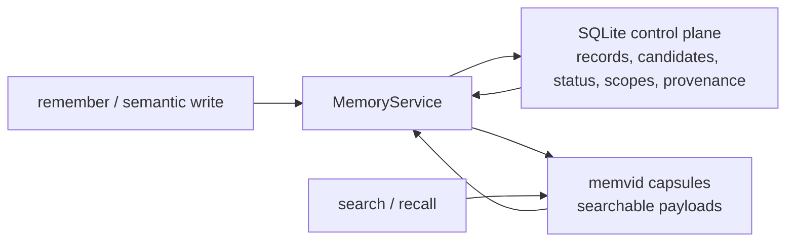
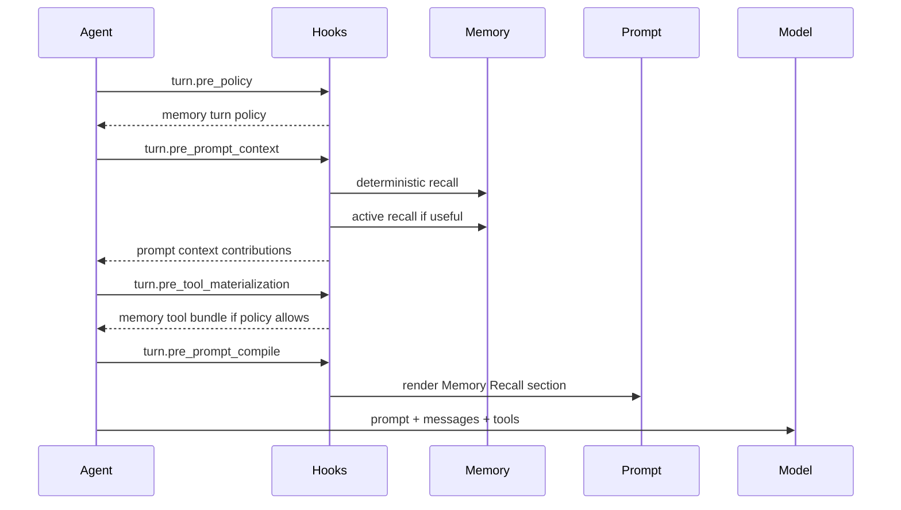

Pioneer memory is a durable domain service, not just a prompt trick. It combines a SQLite control plane, a memvid-backed searchable payload store, model-facing tools, lifecycle hooks, prompt policy, candidate scoring, and service-owned dedupe.

The user-facing behavior is: Pioneer can remember stable facts, recall them when useful, forget them when asked, and avoid creating duplicates. The architectural behavior is: the agent loop dispatches lifecycle phases, memory hooks contribute typed context/tools/prompt sections, and the memory service remains authoritative for storage and visibility.

## Main Components

| Component | Location | Responsibility |
| --- | --- | --- |
| Protocol types | `crates/protocol/src/memory.rs` | Public DTOs, semantic write contracts, candidates, notifications, schemas. |
| Memory service | `crates/memory` | Recall, ranking, semantic write pipeline, candidate policy, tombstones, memvid integration. |
| Control plane | `crates/crud` and `gateway.db` | Memory records, candidates, policy decisions, scopes, provenance, repair jobs. |
| Capsule backend | `memvid-core` through `MemvidMemoryBackend` | Searchable payload storage split by scope capsules. |
| Gateway runtime | `crates/gateway/src/memory_runtime.rs` | Enables/disables memory, resolves runtime config, wires service and operation context. |
| Agent hooks | `crates/agent/src/memory.rs` | Memory policy, recall, tool materialization, prompt contract, post-turn extraction. |
| Prompt contracts | `crates/promt` | Memory recall prompt and post-turn extractor prompt. |

## Storage Model

Memory has two stores with different authority:



Memvid is optimized for retrieval. SQLite is authoritative for policy and visibility. If memvid returns a stale hit, the service checks the control plane before exposing it. Deleted, superseded, expired, repair-needed, sensitive, or out-of-scope records are suppressed.

## Scopes

Memory scopes prevent leakage across unrelated work:

| Scope kind | Use |
| --- | --- |
| `user` | User identity, biography, global preferences. |
| `workspace` | Project-local policies, decisions, procedures, facts. |
| `agent` | Agent-specific facts when allowed by config. |
| `thread` | Narrow turn/thread references for future context systems. |
| `task` | Task-local operational context and future extensions. |

Gateway defaults are configured under `gateway.memory`:

```toml
[gateway.memory]
enabled = true
capsules_dir = "memory/capsules"
allow_global_user_by_default = true
allow_global_agent_by_default = false
```

The capsule directory is resolved under runtime home. Absolute paths, empty paths, `..`, and unsafe runtime escapes are rejected.

## Recall Flow



The recall prompt is not enough by itself and tool exposure is not enough by itself. Pioneer uses both:

- prompt policy tells the model when and how to use memory;
- recalled context gives the model relevant facts without forcing a tool call;
- memory tools let the model search, get exact records, remember, or forget when policy allows.

## Model-Visible Tools

In agent mode, memory can expose:

| Tool | Purpose |
| --- | --- |
| `memory_search` | Search durable memory in active scopes. |
| `memory_get` | Fetch exact details by memory id or scoped key. |
| `memory_remember` | Store durable memory when policy allows. |
| `memory_forget` | Tombstone/suppress memory by id or scoped key. |

Tool exposure is controlled by the memory policy hook and tool-bundle hook. Chat mode does not expose memory tools.

## Semantic Write Pipeline

All durable writes flow through service-owned semantic contracts:

1. The caller supplies `MemorySemanticFields`, content, optional normalized value, evidence, provenance, confidence, importance, and disposition.
2. The service resolves scope and generates the canonical key.
3. The service computes a semantic fingerprint.
4. Existing active memories and candidates are checked for duplicate, compatible update, contradiction, novel fact, or suppressed-by-rejection.
5. Candidate policy scores explicitness, durability, scope clarity, repetition, contradiction, sensitivity, and extractor certainty.
6. The service creates or updates active memory, creates/rejects/suppresses a candidate, or merges evidence.

The model and extractor do not generate canonical keys and do not choose the final active/pending/rejected state.

## Candidate Policy

Candidate policy is the gate between extracted facts and durable memory:

| Case | Default behavior |
| --- | --- |
| High-confidence explicit durable fact | May become active when policy allows. |
| High-confidence implicit durable fact | May become active only when proactive writes are enabled and policy allows. |
| Extremely low score | Rejected or suppressed. |
| Middle score | Rejected or suppressed while review routing is disabled. |
| Secret/transient fact | Rejected/suppressed; should not become active. |
| Duplicate | Evidence merged or duplicate suppressed. |
| Contradiction | Routed by policy; no silent overwrite. |

Dormant review statuses and APIs exist for future UX, but default runtime behavior does not ask the user to approve every middle-confidence candidate.

## Post-Turn Extraction

`MemoryPostTurnExtractorHook` runs after a successful turn on `HookPhase::TurnPostTurn`.

It is deliberately not a subagent:

- no child thread;
- no task artifact;
- no model-facing memory tools;
- no normal assistant answer;
- no direct CRUD writes.

The hook receives a bounded transcript, tool/domain event summaries, and a bounded active/candidate memory manifest. If an internal provider is available, it asks for strict JSON facts using a dedicated extractor prompt. Parsed facts are validated locally and then passed to `MemoryService::write_semantic_memory` with `RouteToCandidatePolicy`.

This is the proactive write path. Pioneer can notice durable facts after the turn, but the service still owns dedupe, scoring, and final state.

## Forgetting

Forgetting creates a control-plane tombstone. It is not just removing a vector payload. Future searches consult the control plane and suppress tombstoned ids even when the backend returns stale results.

Forget can be invoked by:

- `memory_forget` model-visible tool in agent mode;
- `memory/forget` JSON-RPC method;
- future UI management surfaces.

## Observability

Memory behavior is observable through several layers:

- prompt manifests show memory prompt sections and diagnostics;
- hook-run persistence records hook lifecycle, latency, failures, timeouts, and safe diagnostics;
- memory policy decisions and candidate policy outputs are stored in the control plane;
- memory notifications tell clients when active memory changes or is forgotten.

Diagnostics must avoid raw secrets, long transcripts, or raw provider output.

## Safety Invariants

Keep these invariants when changing memory:

- The service owns canonical keys and final write state.
- Hooks never write active memory or candidates directly through CRUD.
- Memvid search results are always filtered through the control plane.
- Chat mode does not mutate memory.
- No-save/no-memory policies must disable inferred writes.
- Prompt context is context, not an instruction that overrides the user.
- Sensitive and secret-like facts must not leak through diagnostics.

## Related Pages

- [Agent Memory](/memory/overview) explains the user-facing behavior.
- [Hook Runtime](/architecture/hooks) explains lifecycle phases and typed contributions.
- [Prompt And Context](/architecture/prompt) explains memory prompt injection.
- [Memory Protocol](/protocol/memory) documents JSON-RPC methods and notifications.
