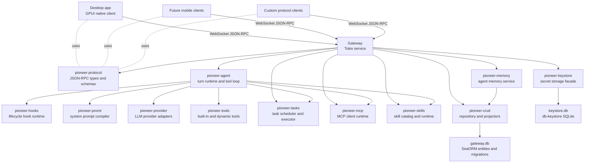

Pioneer is organized around one rule: the gateway is the product core. Clients connect to it, but the gateway owns the durable state, runtime state, model access, tool execution, task execution, MCP runtime, skills runtime, settings, keystore-backed secrets, and history.

The desktop app is the primary client today. It is a native GPUI application that can start a local gateway for a single-machine setup or connect to one or more remote gateways. Other clients can be built against the JSON-RPC protocol without depending on desktop internals.

This architecture is less about "frontend talks to backend" and more about "clients attach to a durable assistant runtime." A gateway can live on a laptop, a workstation, or a remote server. Wherever it lives, that is where the assistant's state and execution live too.

## How To Read This Section

If you are new to the codebase, start here, then read [Gateway](/architecture/gateway), [Agent Loop](/architecture/agent-loop), [Hook Runtime](/architecture/hooks), and [Prompt And Context](/architecture/prompt). Those pages explain the central path from a client message to an LLM request and back to persisted timeline events.

After that, pick the subsystem you are changing:

<CardGroup cols={2}>
  <Card title="Protocol" href="/architecture/protocol">
    Read this before changing JSON-RPC methods, notification payloads, schemas, or anything a client consumes.
  </Card>
  <Card title="Tools" href="/architecture/tools">
    Read this before changing shell/file/web/computer-use tools, output projection, or retry behavior.
  </Card>
  <Card title="Tasks And Subagents" href="/architecture/tasks">
    Read this before changing scheduled work, attached task tools, task trees, or subagent execution.
  </Card>
  <Card title="Agent Memory" href="/architecture/memory">
    Read this before changing durable memory, recall, memvid capsules, semantic writes, or candidate policy.
  </Card>
  <Card title="AGENTS.md" href="/architecture/agents-md">
    Read this before changing thread-tree instruction files, inheritance, editor behavior, protocol payloads, or prompt injection.
  </Card>
  <Card title="Persistence" href="/architecture/persistence">
    Read this before changing tables, projectors, durable events, recovery state, or read models.
  </Card>
</CardGroup>

## System Shape

## Runtime Boundaries

The gateway is the only process that directly mutates Pioneer state. It accepts protocol requests, validates them, updates the in-memory managers when needed, persists the durable read model through `pioneer-crud`, and publishes JSON-RPC notifications to connected sessions.

The agent loop runs inside the gateway. A conversation turn is not a client-side action after submission; it becomes gateway-owned work. The gateway loads history, resolves policies, starts or reuses the agent runtime for the thread, streams model/tool progress back to clients, and persists durable events as the turn changes.

The protocol crate is the public boundary. It defines request and response payloads, notification payloads, method names, error envelopes, task types, tool result types, provider types, MCP types, skill types, prompt manifests, and schema export helpers. Internal crates can change implementation details without changing the client contract as long as the protocol stays stable.

This boundary is what lets Pioneer support many clients without making each client understand how tasks, tools, MCP, skills, and provider adapters are implemented. The desktop app should not know how a tool output is projected for recovery. A mobile app should not know how an MCP stdio process is restarted. A custom client should not know how the task scheduler computes retries. They should all see the same protocol events.

## Why The Gateway Is The Center

Pioneer needs to coordinate things that do not fit cleanly inside a UI process: long-running turns, tool sessions, task schedules, child agent threads, MCP server processes, provider retries, prompt manifests, and recovery state. Putting that work in the gateway gives the system one place to make decisions about state, policy, and durability.

This also makes remote usage straightforward. If the gateway runs on a remote workstation, the assistant can use files, tools, MCP servers, provider settings, and task history from that workstation. The desktop app becomes a window into that gateway instead of the place where work happens.

The tradeoff is that developers must always ask "which host does this code run on?" Provider calls, tool commands, MCP stdio commands, skill dependency checks, and task execution all happen where the gateway runs. Client-side convenience should not accidentally become client-side authority.

## Main Flows

<AccordionGroup>
  <Accordion title="Starting a turn">
    A client calls `turn/start` with a `thread_id`, `turn_id`, selected mode, model, provider, sandbox mode, user input, and optional turn capabilities for composer-selected skills or MCP. The gateway updates the thread manager, persists the turn start through `CrudStore::materialize_turn_start`, ensures an agent runtime exists for the thread, loads conversation history, loads workspace skill policy, and dispatches the turn into `AgentManager::start_turn`.
  </Accordion>

  <Accordion title="Building model input">
    The gateway builds historical chat messages from completed turns. If history is close to the configured context budget, it compresses older turns into a summary with a provider call. The agent runs turn hooks for policy, prompt context, tool materialization, and prompt sections; resolves skills and MCP capabilities; compiles the system prompt with `pioneer-promt`; materializes skill, MCP, and task tools; builds the current user message; appends retained tool context for recovery when needed; and sends a `ChatRequest` through the selected provider.
  </Accordion>

  <Accordion title="Executing tools">
    In agent mode, provider tool calls are routed through `pioneer-tools`. Built-in tools, MCP tools, skill tools, and task orchestration tools are presented through one router. Tool events are forwarded back to the gateway as durable item events and progress events. Tool outputs are projected differently for the model, timeline, storage, and recovery evidence.
  </Accordion>

  <Accordion title="Running tasks and subagents">
    The task runtime stores tasks as durable task events and projected read models. When a task has an agent spec, the gateway task executor creates or restores a hidden child thread, starts a child turn, links thread lineage to the parent task, and reconciles the task result when the child turn completes, fails, or is interrupted.
  </Accordion>

  <Accordion title="Recalling and writing memory">
    Memory hooks classify the turn, recall relevant durable facts, register memory tools when policy allows, render the memory prompt contract, and run post-turn extraction after successful turns. Preflight or `request_tools` decides which registered memory tools are visible to the model. The memory service owns scopes, ranking, canonical keys, dedupe, candidate scoring, tombstones, and memvid-backed storage.
  </Accordion>

  <Accordion title="Loading MCP and skills">
    MCP servers and skills are installed per gateway and per workspace policy. At turn time, enabled and allowed items can be selected implicitly by policy or explicitly through turn capabilities from the composer. Skills contribute a compact skills prompt and optional dynamic tools; MCP contributes dynamic tools only. Disabled or non-implicit items stay installed but are not automatically exposed to the model.
  </Accordion>
</AccordionGroup>

## Durability Model

Pioneer uses an event-heavy read model rather than a single mutable transcript blob. Turns emit durable events such as item started, item completed, prompt manifest compiled, skill bindings resolved, MCP bindings created, provider failures, recovery events, and terminal turn state. Tasks have their own task event stream and projector.

The database stores both source events and projected tables. This lets the UI load fast read models while still keeping enough event data to audit and recover execution. It also means a developer should treat projectors and repository methods as part of the architecture, not as incidental persistence code.

The practical reason is failure handling. A turn can stream text, call a shell command, receive a partial tool result, hit a provider timeout, create child tasks, or be cancelled by the user. If all of that lived only in memory, a gateway restart would turn every interesting failure into a mystery. Durable events give Pioneer something to reconcile.

For details, read [Persistence Layer](/architecture/persistence) after this overview. For the event producer side, read [Agent Loop](/architecture/agent-loop) and [Tasks And Subagents](/architecture/tasks).

## Current Important Limitations

Pioneer is early-stage software. Some protocol and storage shapes are still ahead of the desktop UI. Workspace creation, switching, and renaming are exposed, but workspace deletion, archival, and cross-workspace thread moves are not part of the current desktop workflow.

Tool runs are not sandboxed yet. Built-in tools and dynamic tools currently execute with the privileges of the OS user running the gateway. This is an architectural fact developers must keep in mind when working on tools, MCP, skills, and remote gateway deployment.

## Related Pages

- [Crate Map](/architecture/crates) explains where each piece lives in the Rust workspace.
- [Gateway](/architecture/gateway) follows request handling and runtime ownership.
- [Hook Runtime](/architecture/hooks) explains how lifecycle phases and typed contributions keep domain logic out of the agent loop.
- [Prompt And Context](/architecture/prompt) explains how history, prompt sections, skills, memory, retries, and runtime facts become model input.
- [AGENTS.md Architecture](/architecture/agents-md) explains thread-tree instruction files, inheritance, and hook-based prompt injection.
- [Tools System](/architecture/tools), [MCP Architecture](/architecture/mcp), and [Skills Architecture](/architecture/skills) explain the three main ways the model gets capabilities beyond plain chat.
