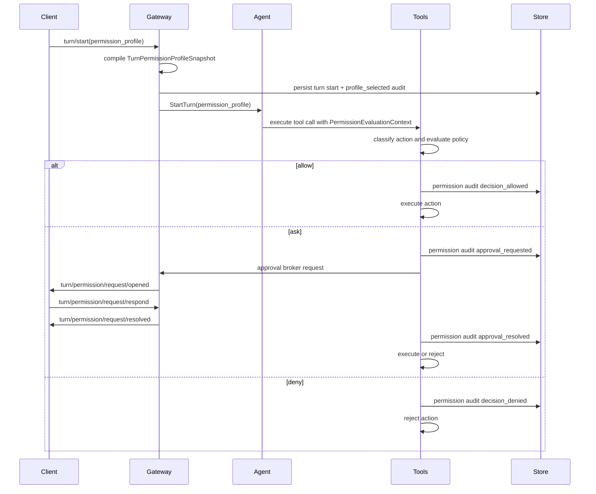

Pioneer has a turn-scoped permission system for agent work. A client selects a permission profile when starting a turn, the gateway compiles it into an effective tool policy, the tools runtime evaluates each side-effecting action against that policy, and clients receive approval requests when the policy says to ask.

This is an application-level permission boundary. It controls which actions Pioneer allows, asks about, denies, audits, and describes to the model. It is not a separate OS, VM, or container sandbox: tool processes still run on the gateway host under the gateway OS account. Use separate gateways or host-level isolation when the machine, credentials, filesystem, or network boundary must be different.

## Main Types

The public protocol types live in `crates/protocol/src/turn.rs`, with policy compilation helpers in `crates/protocol/src/turn_permissions.rs`.

| Type | Purpose |
| --- | --- |
| `TurnPermissionProfileSelection` | Client request shape in `turn/start`. Currently selects a `mode`. |
| `TurnPermissionProfileSnapshot` | Materialized profile stored on the `Turn`, including `mode`, `source`, and `effective_policy`. |
| `ToolPermissionPolicySnapshot` | Effective `allow`, `ask`, or `deny` behavior per action kind plus optional tool/path allow and deny lists. |
| `TurnPermissionApprovalRequest` | Client-visible request opened when a tool action needs user approval. |
| `TurnPermissionAuditEvent` | Durable audit row for profile selection, allowed decisions, denied decisions, approval requests, and approval resolutions. |
| `TurnPermissionProfileCap` | Permission cap passed to task/subagent execution so child turns cannot silently broaden the parent policy. |

## Permission Modes

The desktop composer exposes the same three protocol modes in this order:

| Mode | UI label | Default policy |
| --- | --- | --- |
| `full_access` | Full access | Allows file reads, file writes, shell commands, network, MCP, skill tools, computer use, and task/subagent launches without Pioneer approval prompts. This is the default when no profile is selected. |
| `auto_accept_edits` | Auto-accept edits | Allows file reads, file writes, and MCP reads. Shell commands, network, MCP writes or unknown MCP calls, dynamic skill tools, computer use, task/subagent launches, and unknown actions ask for approval. |
| `supervised` | Supervised | Allows file reads and MCP reads. File writes, shell commands, network, MCP writes or unknown MCP calls, dynamic skill tools, computer use, task/subagent launches, and unknown actions ask for approval. |

The policy vocabulary is intentionally small:

| Behavior | Meaning |
| --- | --- |
| `allow` | Execute without an approval prompt. |
| `ask` | Open an approval request and wait for a client response. |
| `deny` | Reject the action before execution. |

Current built-in modes use `allow` and `ask`; the protocol and evaluator also support `deny`.

## Profile Sources

`TurnPermissionProfileSource` records why a profile exists:

| Source | Meaning |
| --- | --- |
| `composer` | The user/client selected a permission mode for this turn. |
| `defaulted` | No profile was provided, so Pioneer used the default full-access profile. |
| `inherited_from_parent_turn` | A child or continuation inherited a parent profile. |
| `task_permission_cap` | A task/subagent turn was capped by task policy. |
| `system` | The gateway selected a system-owned profile. |

The source is persisted with the profile snapshot and repeated in permission audit events. This lets clients explain not only what policy applied, but where it came from.

## Evaluation Flow

Permission evaluation happens inside the normal tools runtime, not in individual client shells.

The evaluator classifies tool calls into `TurnPermissionActionKind`:

- `file_read`
- `file_write`
- `shell_command`
- `network`
- `mcp_read`
- `mcp_write_or_unknown`
- `dynamic_skill_tool`
- `computer_use`
- `task_subagent`
- `internal`
- `unknown`

Approval requests include the tool name, action kind, a normalized `scope_hash`, a machine-readable reason, an optional summary, and display details. The `scope_hash` is used for the `allow_for_turn` cache: if the user allows the same normalized action scope for the rest of the turn, later matching asks can proceed without opening another prompt.

## Approval Responses

Clients respond through `turn/permission/request/respond` with one of:

| Resolution | Behavior |
| --- | --- |
| `allow_once` | Allow this request only. |
| `allow_for_turn` | Allow this normalized request scope for the rest of the turn. |
| `deny` | Reject the action. |
| `cancelled` | Treat the prompt as cancelled by the user/client. |
| `expired` | Treat the prompt as timed out or stale. |

The gateway resolves pending requests idempotently. It publishes `turn/permission/request/resolved` after a response, cancellation, or expiry so clients can clear actionable UI.

## Audit Events

Permission decisions are durable turn events. The important event kinds are:

| Event kind | Meaning |
| --- | --- |
| `profile_selected` | A turn's effective permission profile was materialized and persisted. |
| `decision_allowed` | A tool action was allowed by policy or a cached approval. |
| `decision_denied` | A tool action was denied by policy. |
| `approval_requested` | A tool action required user approval. |
| `approval_resolved` | A user/client resolution was applied. |

Audit events include profile mode/source, optional item/tool ids, action kind, optional request key, decision, reason, and whether a cached approval was used. They are persisted through `pioneer-crud`, replayable through turn item/history APIs, and projected by the shared client core into timeline rows when the event should be visible.

## Prompt Integration

Restricted profiles are also described to the model. `pioneer-promt` renders a `Current Permissions` runtime section for non-default or narrowed policies. The section tells the model which actions may require approval and instructs it to continue with allowed alternatives when an action is denied.

The default unconstrained `full_access` profile does not add this prompt section, which keeps ordinary full-access turns from paying a prompt cost for redundant policy text.

## CLI Runtime Mapping

CLI-backed turns use the same Pioneer permission profile at the protocol boundary. The gateway then maps that profile into the runtime-specific approval policy:

| Pioneer mode | Codex mapping | Claude mapping |
| --- | --- | --- |
| `full_access` | `never` | `bypassPermissions` |
| `auto_accept_edits` | `on-request` as a stricter fallback | `acceptEdits` |
| `supervised` | `on-request` | `default` |

Codex currently has no distinct policy that matches Pioneer's `auto_accept_edits` exactly, so the adapter intentionally uses the stricter `on-request` fallback and records that mapping quality.

CLI runtime requests opened by the native runtime still use the CLI runtime pending-request surface (`cli_runtime/request/respond`). Pioneer turn permission requests from the native tools runtime use `turn/permission/request/respond`.

## Tasks And Subagents

Task-backed child turns receive a permission cap. The task runtime can derive a `TurnPermissionProfileCap` from the parent profile or task policy, and child runs are materialized with source `task_permission_cap` or inherited source data.

Policy intersection is restrictive: `deny` wins over `ask`, `ask` wins over `allow`, and the most restrictive mode wins in the order `supervised`, `auto_accept_edits`, `full_access`. This prevents delegated or scheduled child work from silently expanding access beyond the parent/task contract.

## Developer Rules

- Treat permission profiles as part of `turn/start` semantics, not client-only UI state.
- Persist profile selection and permission audit events before depending on in-memory execution state.
- Route side-effecting tool calls through the tools runtime so action classification, approval, audit, retry, and output policy stay consistent.
- Do not implement one-off approval prompts inside a tool handler. Add action classification and use the shared approval broker instead.
- Keep user-facing safety copy precise: Pioneer has permission modes and approval gates, but not a separate host sandbox for tool processes.
- When adding a protocol field, action kind, decision reason, or notification, update protocol schemas, client reducers/FFI projections, and [Turns API](/protocol/turns).

## Related Pages

- [Tools System](/architecture/tools) explains where permission evaluation sits in tool execution.
- [Agent Loop](/architecture/agent-loop) explains how permission profiles enter agent turns and prompt compilation.
- [Protocol Layer](/architecture/protocol) explains the JSON-RPC method and notification contract.
- [CLI Runtime Architecture](/architecture/cli-runtime) explains runtime-specific approval mapping.
- [Tasks And Subagents](/architecture/tasks) explains delegated child turns and task execution.
