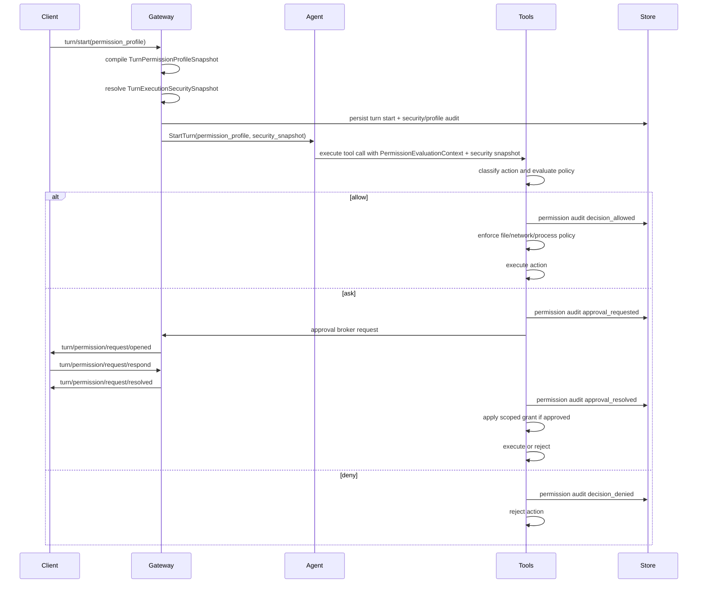

Pioneer has a turn-scoped security model for agent work. A client selects a permission profile when starting a turn, the gateway resolves it into a `TurnExecutionSecuritySnapshot`, and the tools runtime enforces that snapshot before side effects run.

The snapshot combines user-visible permission behavior with concrete execution controls:

- tool actions can be allowed, denied, or routed through an approval prompt;
- file tools are checked against resolved read/write roots before opening paths;
- web tools are checked against the turn network policy before network access;
- shell commands receive a process policy for cwd, environment filtering, timeout, and command risk;
- native shell execution can use the `nono` sandbox backend on Linux/macOS or a restricted-token backend on Windows when the resolved snapshot requires a native sandbox;
- CLI-backed runtimes use their provider-native sandbox and approval capabilities when available;
- every decision is auditable through durable turn events.

This page describes the gateway-side security contract. The user-facing overview is [Permission Modes](/getting-started/permissions), and the protocol shape is documented in [Turns API](/protocol/turns).

## Main Types

The public protocol types live in `crates/protocol/src/turn.rs`, with policy compilation helpers in `crates/protocol/src/turn_permissions.rs`.

| Type | Purpose |
| --- | --- |
| `TurnPermissionProfileSelection` | Client request shape in `turn/start`. Currently selects a `mode`. |
| `TurnPermissionProfileSnapshot` | Materialized profile stored on the `Turn`, including `mode`, `source`, and `effective_policy`. |
| `TurnExecutionSecuritySnapshot` | Resolved execution contract for one turn: permission profile, sandbox, filesystem, network, process, approval, backend, enforcement status, and optional parent cap. |
| `TurnSandboxSnapshot` | Sandbox mode, cwd, filesystem entries, temporary-directory policy, network policy mirror, backend requirement, and backend preference. |
| `TurnNetworkPolicySnapshot` | Network mode plus allow/deny domain data. |
| `TurnProcessPolicySnapshot` | Shell enablement, environment inheritance/filtering, timeout cap, and command-risk rules. |
| `TurnSecurityBackendSnapshot` | Execution backend, sandbox backend, backend provider id, and backend security capabilities. |
| `TurnSecurityEnforcementStatus` | Whether the resolved security policy is active, partially active with degradations, or unavailable. |
| `ToolPermissionPolicySnapshot` | Effective `allow`, `ask`, or `deny` behavior per action kind plus optional tool/path allow and deny lists. |
| `TurnPermissionApprovalRequest` | Client-visible request opened when a tool action needs user approval. |
| `TurnPermissionAuditEvent` | Durable audit row for profile selection, allowed decisions, denied decisions, approval requests, and approval resolutions. |
| `TurnPermissionProfileCap` / `TaskAgentSecurityCap` | Caps passed to task/subagent execution so child turns cannot silently broaden parent permissions, filesystem roots, network policy, sandbox mode, or process policy. |

## Permission Modes

The desktop composer exposes the same three protocol modes in this order:

| Mode | UI label | Sandbox mode | Default policy |
| --- | --- | --- | --- |
| `full_access` | Full access | `unrestricted` | Allows file reads, file writes, shell commands, network, MCP, skill tools, computer use, and task/subagent launches without Pioneer approval prompts. This is the default when no profile is selected. |
| `auto_accept_edits` | Auto-accept edits | `workspace_write` | Allows file reads, file writes, and MCP reads. Shell commands, network, MCP writes or unknown MCP calls, dynamic skill tools, computer use, task/subagent launches, and unknown actions ask for approval. Filesystem policy grants write access to resolved workspace/project roots and read access to app runtime roots. Network starts disabled until approved or granted. |
| `supervised` | Supervised | `read_only` | Allows file reads and MCP reads. File writes, shell commands, network, MCP writes or unknown MCP calls, dynamic skill tools, computer use, task/subagent launches, and unknown actions ask for approval. Filesystem policy grants read access to resolved workspace/project/app roots. Network starts disabled until approved or granted. |

The policy vocabulary is intentionally small:

| Behavior | Meaning |
| --- | --- |
| `allow` | Execute without an approval prompt. |
| `ask` | Open an approval request and wait for a client response. |
| `deny` | Reject the action before execution. |

Current built-in modes use `allow` and `ask`; the protocol and evaluator also support `deny`.

## Execution Security Snapshot

`TurnExecutionSecuritySnapshot` is the executable form of the permission choice. The gateway builds it in `crates/gateway/src/turn_security.rs` before the agent turn runs and attaches it to tool invocations.

| Snapshot area | What it controls |
| --- | --- |
| `permission_profile` | The compiled `TurnPermissionProfileSnapshot` used by the tool permission evaluator and prompt runtime section. |
| `sandbox.mode` | `unrestricted`, `workspace_write`, or `read_only`. |
| `sandbox.cwd` | The resolved working directory for relative paths and process cwd checks. |
| `sandbox.filesystem.entries` | Read/write roots such as workspace root, project roots, and runtime app read roots. Entries record provenance: workspace, project, runtime, task cap, system, or composer selection. |
| `sandbox.tmp` | Host or isolated temp policy. Restricted modes use isolated temp policy. |
| `network` | `enabled`, `restricted`, or `disabled`, with domain allow/deny lists and localhost/socket flags. Restricted built-in modes start with network disabled and can receive grants through approved requests. |
| `process` | Shell enabled flag, stdin/session inheritance flags, environment filtering, max duration, denied commands, and allowed command families. Restricted modes filter token/secret/password-like environment names. |
| `approval` | Which approval scopes are allowed. Built-in restricted modes allow `allow_once` and `allow_for_turn`; they do not allow session-wide or always grants. |
| `backend` | Native, Codex CLI, or Claude CLI execution backend plus the sandbox backend selected for that turn. |
| `enforcement` | `active`, `partially_active`, or `unavailable`. Degradations name missing backend capabilities such as filesystem, network, process, approval, or sandbox backend. |
| `parent_cap` | Present when a task/subagent turn inherits a narrower parent/task security cap. |

The built-in resolver maps modes to snapshots as follows:

| Permission mode | Sandbox mode | Filesystem | Network | Process | Backend requirement |
| --- | --- | --- | --- | --- | --- |
| `full_access` | `unrestricted` | Unrestricted | Enabled | Unrestricted | Optional |
| `auto_accept_edits` | `workspace_write` | Workspace/project roots writable; app read roots read-only | Disabled until granted | Restricted env and timeout policy | Required |
| `supervised` | `read_only` | Workspace/project/app roots read-only | Disabled until granted | Restricted env and timeout policy | Required |

For native API-provider turns, restricted modes use the native sandbox backend: `nono` on Linux/macOS and Windows restricted tokens on Windows. For CLI-backed turns, the gateway records the runtime provider's sandbox and approval capabilities and marks enforcement active, partially active, or unavailable based on what that runtime can enforce.

## Profile Sources

`TurnPermissionProfileSource` records why a profile exists:

| Source | Meaning |
| --- | --- |
| `composer` | The user/client selected a permission mode for this turn. |
| `defaulted` | No profile was provided, so Pioneer used the default full-access profile. |
| `inherited_from_parent_turn` | A child or continuation inherited a parent profile. |
| `task_permission_cap` | A task/subagent turn was capped by task policy. |
| `system` | The gateway selected a system-owned profile. |

The source is persisted with the profile snapshot and repeated in permission audit events. This lets clients explain not only what policy applied, but where it came from.

## Evaluation Flow

Permission evaluation happens inside the normal tools runtime, not in individual client shells.

The evaluator classifies tool calls into `TurnPermissionActionKind`:

- `file_read`
- `file_write`
- `shell_command`
- `network`
- `mcp_read`
- `mcp_write_or_unknown`
- `dynamic_skill_tool`
- `computer_use`
- `task_subagent`
- `internal`
- `unknown`

Approval requests include the tool name, action kind, a normalized `scope_hash`, a machine-readable reason, an optional summary, display details, and `visible_thread_ids` when the approval UI should associate the request with more than one visible thread. The `scope_hash` is used for the `allow_for_turn` cache: if the user allows the same normalized action scope for the rest of the turn, later matching asks can proceed without opening another prompt.

## Filesystem, Network, And Process Enforcement

The permission evaluator answers "may this kind of tool action proceed now?" The security snapshot answers "what resource boundary applies if it proceeds?"

Filesystem tools call `FilePolicyChecker` before reading, listing, grepping, writing, editing, applying patches, or writing downloads. The checker resolves relative paths against `sandbox.cwd`, canonicalizes existing paths, handles new write targets through the canonical parent directory, rejects paths outside allowed roots, rejects write attempts under read-only roots, and rejects symlink escapes.

Web tools call `NetworkPolicyChecker` before search, fetch, or download. It accepts HTTP and HTTPS URLs only, checks denied domains before allow rules, rejects disabled network access, and supports restricted allowlists plus localhost policy. `download_url` also checks the destination path through the filesystem policy before opening the network request.

Shell execution builds a `ProcessSpawnPlan` from the snapshot before spawning. The plan enforces shell enablement, denied/allowed command-family rules, cwd access, environment filtering, and timeout caps. Native shell execution then prepares the native sandbox backend when one is selected. A provider-native sandbox snapshot is rejected on the native shell path because that backend can protect provider-runtime execution, not a Pioneer-spawned local process.

Approval can also add scoped grants. If the user approves a filesystem or network action once, the current invocation receives the grant. If the user approves it for the turn, matching grants are cached for the same turn and merged into later invocations without widening unrelated scopes.

## Approval Responses

Clients respond through `turn/permission/request/respond` with one of:

| Resolution | Behavior |
| --- | --- |
| `allow_once` | Allow this request only. |
| `allow_for_turn` | Allow this normalized request scope for the rest of the turn. |
| `deny` | Reject the action. |
| `cancelled` | Treat the prompt as cancelled by the user/client. |
| `expired` | Treat the prompt as timed out or stale. |

The gateway resolves pending requests idempotently. It publishes `turn/permission/request/resolved` after a response, cancellation, or expiry so clients can clear actionable UI.

## Audit Events

Permission decisions are durable turn events. The important event kinds are:

| Event kind | Meaning |
| --- | --- |
| `profile_selected` | A turn's effective permission profile was materialized and persisted. |
| `decision_allowed` | A tool action was allowed by policy or a cached approval. |
| `decision_denied` | A tool action was denied by policy. |
| `approval_requested` | A tool action required user approval. |
| `approval_resolved` | A user/client resolution was applied. |

Audit events include profile mode/source, optional item/tool ids, action kind, optional request key, decision, reason, and whether a cached approval was used. They are persisted through `pioneer-crud`, replayable through turn item/history APIs, and projected by the shared client core into timeline rows when the event should be visible.

## Prompt Integration

Restricted profiles are also described to the model. `pioneer-promt` renders a `Current Permissions` runtime section for non-default or narrowed policies. The section tells the model which actions may require approval and instructs it to continue with allowed alternatives when an action is denied.

The default unconstrained `full_access` profile does not add this prompt section, which keeps ordinary full-access turns from paying a prompt cost for redundant policy text.

## CLI Runtime Mapping

CLI-backed turns use the same Pioneer permission profile at the protocol boundary. The gateway then maps that profile into the runtime-specific approval policy:

| Pioneer mode | Codex mapping | Claude mapping |
| --- | --- | --- |
| `full_access` | `never` | `bypassPermissions` |
| `auto_accept_edits` | `on-request` as a stricter fallback | `acceptEdits` |
| `supervised` | `on-request` | `default` |

Codex currently has no distinct policy that matches Pioneer's `auto_accept_edits` exactly, so the adapter intentionally uses the stricter `on-request` fallback and records that mapping quality.

CLI runtime requests opened by the native runtime still use the CLI runtime pending-request surface (`cli_runtime/request/respond`). Pioneer turn permission requests from the native tools runtime use `turn/permission/request/respond`.

## Tasks And Subagents

Task-backed child turns receive a security cap. The task runtime can derive a `TurnPermissionProfileCap` and `TaskAgentSecurityCap` from the parent profile or task policy, and child runs are materialized with source `task_permission_cap` or inherited source data.

Policy intersection is restrictive: `deny` wins over `ask`, `ask` wins over `allow`, and the most restrictive mode wins in the order `supervised`, `auto_accept_edits`, `full_access`. Sandbox mode, network policy, process policy, and filesystem roots are also intersected against the parent/task cap. This prevents delegated or scheduled child work from silently expanding access beyond the parent/task contract.

## Developer Rules

- Treat permission profiles as part of `turn/start` semantics, not client-only UI state.
- Resolve and persist the execution security snapshot before depending on in-memory execution state.
- Route side-effecting tool calls through the tools runtime so action classification, approval, audit, retry, and output policy stay consistent.
- Do not implement one-off approval prompts inside a tool handler. Add action classification and use the shared approval broker instead.
- Keep user-facing safety copy precise: permission modes, sandbox snapshots, native/provider sandbox backends, file policy, network policy, process policy, and audit events are real enforcement layers; stronger deployment boundaries still come from choosing the right gateway host and OS account.
- When adding a protocol field, action kind, decision reason, or notification, update protocol schemas, client reducers/FFI projections, and [Turns API](/protocol/turns).

## Related Pages

- [Tools System](/architecture/tools) explains where permission evaluation sits in tool execution.
- [Agent Loop](/architecture/agent-loop) explains how permission profiles enter agent turns and prompt compilation.
- [Protocol Layer](/architecture/protocol) explains the JSON-RPC method and notification contract.
- [CLI Runtime Architecture](/architecture/cli-runtime) explains runtime-specific approval mapping.
- [Tasks And Subagents](/architecture/tasks) explains delegated child turns and task execution.
