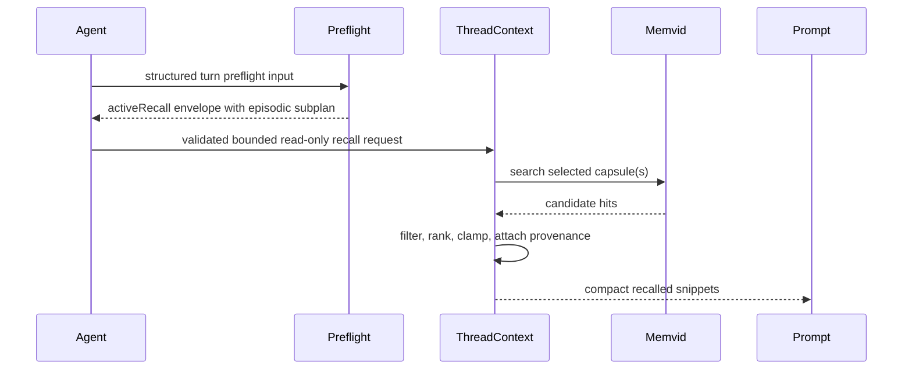

Thread episodic context is Pioneer's searchable memory of conversation history. It is the answer to a different problem than durable agent memory.

Durable memory stores selected long-lived facts: user preferences, names, project decisions, recurring instructions, and other stable facts. Thread episodic context stores searchable fragments of conversation history so the assistant can recover useful prior discussion when a later turn asks for it.

The product goal is simple: Pioneer should be able to answer questions like "what did we decide earlier?", "what did you say in yesterday's research?", or "why did you identify the car that way?" without putting the full thread transcript and every old file into every provider request.

## What It Is For

Thread episodic context is useful when the user refers to prior discussion instead of a durable fact:

- "continue the implementation plan from earlier";
- "what did you answer yesterday in the research thread?";
- "use the API constraints we discussed above";
- "why did you say that the image showed this model?";
- "find the message where we decided to remove that fallback."

Those are not necessarily things Pioneer should permanently remember as profile facts. They are conversation episodes. They matter because they happened in a thread, at a time, with surrounding messages, tool results, and sometimes artifacts.

## What It Is Not

Thread episodic context is not a raw transcript dump. It is also not a replacement for durable memory.

| Need | Use |
| --- | --- |
| "Remember that my birthday is May 6." | Durable memory. |
| "What did we discuss three turns ago?" | Retained recent history or thread episodic context. |
| "What was the plan from yesterday's architecture discussion?" | Thread/workspace episodic recall. |
| "Always answer me in Russian." | Durable memory or explicit current instruction. |
| "Read the PDF I uploaded in that old message." | Thread episodic recall may recover the message; `artifact_read` loads the file only if needed. |

This split keeps memory cleaner. A thread can contain thousands of temporary thoughts, failed attempts, and one-off details. Most of that should stay searchable history, not become permanent agent memory.

## Storage Model

Thread episodic context uses a database control plane plus memvid searchable capsules.


The database stores the authoritative metadata:

- workspace id;
- thread id;
- turn id;
- item id;
- chunk index;
- role/source context;
- status;
- text hash;
- capsule/indexing state;
- retry and repair state.

Memvid stores the searchable payload. A memvid hit is not enough by itself. The gateway still checks the database row, scope, status, and prompt budget before showing a snippet to the model.

## Why Chunks Exist

Some messages are short. A single user message might be one sentence, and the whole message can be indexed as one chunk.

Some messages are long. An assistant answer can contain a full research report, multiple alternatives, code, tool summaries, and conclusions. Searching that as one giant block gives poor recall: one relevant sentence is buried inside unrelated text, and one hit can consume too much prompt budget.

Chunks give Pioneer smaller searchable units with exact provenance:

```text
thread A / turn 41 / assistant item 1 / chunk 0
thread A / turn 41 / assistant item 1 / chunk 1
thread A / turn 41 / assistant item 1 / chunk 2
```

The chunk id does not replace the original message. It lets recall say, "this part of that old assistant answer is relevant," and then include a compact snippet instead of the whole answer.

## What Gets Indexed

Thread episodic context indexes visible conversation material that can help future turns. The normal sources are user messages and assistant messages. Tool and task output are not dumped wholesale into the index; when they become useful, they should be summarized or projected into a human-meaningful text surface first.

This matters because raw tool output can be huge, noisy, or sensitive. The thread context layer is for recallable conversation context, not for storing every byte that passed through a tool.

## Recall Flow

Thread episodic recall is usually planned before the main model answer:



The preflight planner does not read memvid directly. It returns a structured plan. Rust validates that plan and runs the search through the gateway service. If the plan is invalid, unsupported, too broad, or too ambiguous, the gateway can skip episodic recall safely.

## Current Thread And Workspace Recall

There are two useful recall shapes:

| Shape | Meaning |
| --- | --- |
| Current-thread recall | Search earlier indexed context from the same thread. Useful for long threads and local follow-ups. |
| Workspace-thread recall | Search indexed context across threads in the same workspace. Useful for "what did we discuss yesterday?" or "find the prior research thread." |

Both must stay bounded. Workspace-wide recall is powerful, but it should not become a prompt firehose. The service uses query plans, filters, candidate limits, ranking, and prompt budgets before context reaches the model.

## Artifact References

Conversation history often includes files: photos, screenshots, PDFs, CSVs, logs, and generated reports. Thread episodic context does not inline those file bytes into indexed chunks.

Instead, if a recalled snippet came from a message with artifacts, Pioneer can render a scoped artifact-reference block for that snippet:

```text
Relevant thread context:
- [thread:turn_41/item_1/chunk_0, source=current thread, boundary=snippet]: What car is this?

Available artifacts for thread:turn_41/item_1/chunk_0:
- artifactId=art_car, versionId=ver_car_1, name="car.jpg", kind=image, mime=image/jpeg, size=842 KB, role=user.
```

The model can then request the hidden `artifact` tool domain and call `artifact_read` if it actually needs the image or file content. If the question can be answered from the text snippet alone, no artifact bytes are loaded.

## Configuration

Thread context is controlled under `gateway.thread_episodic`:

```toml
[gateway.thread_episodic]
enabled = true
indexing_enabled = true
recall_enabled = true
default_prompt_chars = 2400
max_prompt_chars = 12000
max_hit_chars = 1200
default_max_candidates = 32
max_candidate_work = 128
max_segments = 16
min_relevancy = 0.25
min_results = 1
snippet_chars = 360
chunk_target_min_chars = 700
chunk_target_max_chars = 1200
chunk_max_chars = 1600
max_chunks_per_item = 64
index_batch_limit = 16
retry_base_delay_secs = 30
retry_max_delay_secs = 900
max_attempts = 5
near_capacity_percent = 90.0
```

The desktop app exposes the high-level thread-context switch in **Settings > Memory**. Other values are operator/developer tuning knobs and are available through app config or gateway settings APIs where exposed.

## Operational Notes

Indexing is asynchronous and retryable. A message may be visible in the timeline before its thread-context chunk is searchable. That is expected. Recent conversation history still goes into the provider request directly, so the assistant does not need episodic recall for the last few messages.

Recall is best-effort. If the query is too vague, the indexed text is not ready, or the prompt budget is too small, no snippet may be injected. The assistant should still answer from the current prompt and available tools rather than assuming recall is perfect.

## Developer Rules

- Keep thread episodic storage separate from durable memory storage.
- Do not turn every thread chunk into an active durable memory record.
- Do not add a fallback that simply dumps recent history again; recent history is already part of normal conversation messages.
- Filter memvid hits through the database control plane before prompt injection.
- Keep artifact refs scoped to the recalled snippet that produced them.
- Do not send artifact bytes unless the model explicitly reads a specific artifact through `artifact_read`.
- Keep search bounded by workspace/thread filters, candidate limits, and prompt budgets.

## Related Pages

- [Memory Architecture](/architecture/memory) explains durable memory and active recall.
- [Prompt And Context](/architecture/prompt) explains how recalled snippets enter the model prompt.
- [Artifact Store](/architecture/artifacts) explains artifact refs and `artifact_read`.
- [Configuration Reference](/configuration/reference) lists thread episodic settings.
